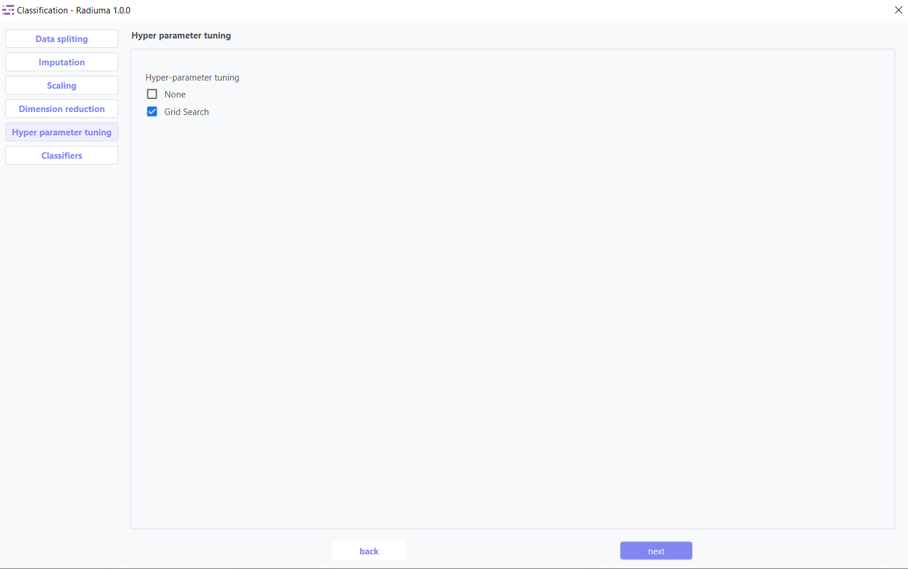
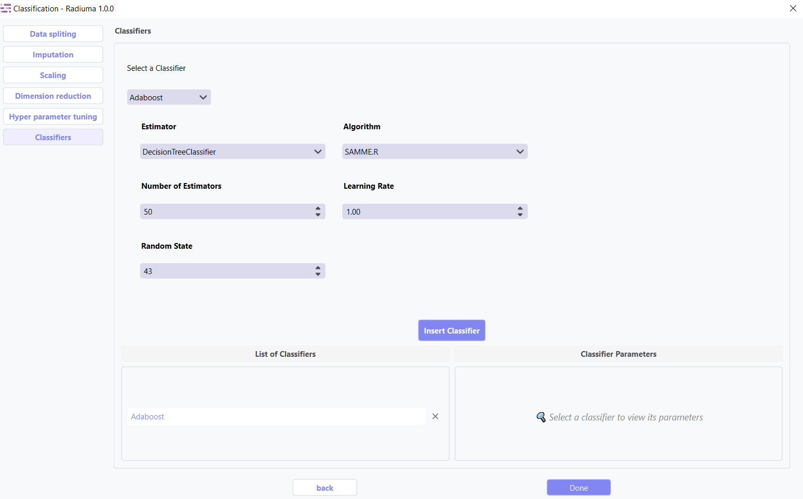

Classification
--------------

Overview
^^^^^^^^

.. image:: images/14.classification.png
   :alt: Classification
   :width: 100%

The **Classification** module provides a user-friendly, step-by-step interface that guides you through the entire machine learning process within the application. Starting with data import, the module automatically validates your feature and target tables to ensure proper formatting before proceeding to the analysis phase. Through a structured workflow of configurable panels, you can sequentially apply data splitting strategies, handle missing values with advanced imputation methods, normalize features using multiple scaling techniques, and optimize your dataset through dimension reduction. The interface then presents a comprehensive selection of classification algorithms with customizable parameters, allowing you to train and compare multiple models simultaneously. Finally, the system generates detailed performance metrics and visualizations, enabling you to select the optimal model for your specific clinical or research needs—all within a single, integrated environment designed for both machine learning experts and clinical researchers.

Complete machine learning pipeline with:

* 7+ classification algorithms
* Automated data preprocessing
* Hyperparameter optimization
* Comprehensive model evaluation

Data Import
^^^^^^^^^^^

Before splitting or processing your data, ensure it is **properly structured**.

.. note::
   Both **feature** and **target** tables must follow these requirements:

   1. **Identical Sample IDs** in the first column of both tables.
   2. Sample IDs must **match exactly**.  
      e.g., `Patient_001` in the feature table = `Patient_001` in the target table.
   3. Target column must be **categorical** for classification tasks (e.g., `High` / `Low` or `0` / `1`).

**Data Import Steps:**

1. **Import Feature Table**

   .. image:: images/14.classification_input_Data.png
      :alt: Import Feature Table
      :width: 80%

   Select your main data table containing all **features/predictors**.  
   Preview the table to verify structure.

2. **Import Target Table**

   .. image:: images/14.classification_Input_target.png
      :alt: Import Target Table
      :width: 80%

   Select your target table containing only **Sample IDs** and **Class Labels**.  
   Preview the table to verify structure.

Data Splitting
^^^^^^^^^^^^^^

**Important Note :** 

* **Data Requirement**: The first column of both the input data and the target data must contain identical sample IDs.

**Data Splitting Options:**

* **Shuffle**: Enable shuffling to randomize the data before splitting
* **Split**: Choose between percentage split or K-fold cross-validation
* **Percentage**: Specify training data percentage (e.g., 80%)
* **K-fold**: Set the number of folds for cross-validation
* **Perform Final Test**: Option to reserve data for final testing

Imputation
^^^^^^^^^^

The imputation step addresses missing values in your dataset by replacing them with calculated values using three advanced strategies: **Simple Imputer, KNN Imputer, and Iterative Imputer**. Options include mean, median, or mode imputation for categorical data, ensuring your classification models have complete datasets for accurate predictions.

1. **Simple Imputer:** Basic replacement strategies for quick handling of missing data.

**Imputation Options:**

* **Continuous Missing Value**: Strategy for handling missing numerical values
* **Categorical Missing Value**: Strategy for handling missing categorical values

**Imputation Strategy:**

* **Mean**: Replace with feature mean
* **Median**: Replace with feature median
* **Most Frequent**: Replace with most common value
* **Constant**: Replace with user-specified value

2. **KNN Imputer:** Nearest-neighbor based imputation using feature similarity.

* **Key Parameters**:
   
* **n_neighbors** (default: 5) – Number of neighbors used to impute missing values
* **metric** – Distance function non-euclidean, 
* **weights** – uniform or distance (distance gives more weight to closer neighbors)

3. **Iterative Imputer:** Advanced method that models each feature with missing values as a function of other features.

* **Key Parameters**:

* **Estimator**  
  Algorithm used to predict missing values for each feature.  

  Common options include:

  - **BayesianRidge** *(default)* – Performs regularized linear regression using Bayesian principles  
  - **GaussianProcessRegressor** – Models non-linear relationships with probabilistic output  
  - **KernelRidge** – Combines ridge regression with kernel tricks for non-linear features  
  - **KNeighborsRegressor** – Uses neighboring samples to estimate missing values  
  - **LinearRegression** – Basic linear approach for imputation  
  - **Lasso / Ridge / ElasticNet** – Regularized linear models for better generalization

* **Imputation Order**  
  Determines the sequence in which features are imputed:

  - **Ascending** *(default)* – Start from features with fewest missing values  
  - **Descending** – Start from features with most missing values  
  - **Random** – Random order for each iteration  
  - **Roman** – Left-to-right (fixed order)

Scaling
^^^^^^^

.. image:: images/14.classification_scaling.png
   :alt: Classification Scaling
   :width: 100%

Feature scaling transforms your features to a common scale, which is essential for many classification algorithms that are sensitive to feature magnitudes. Methods like StandardScaler, MinMaxScaler,Max abs Scaler,Normalizer and RobustScaler help improve model convergence and performance.

Dimention Reduction
^^^^^^^^^^^^^^^^^

Dimension reduction techniques optimize your dataset by identifying and retaining only the most valuable features. These methods serve two primary purposes:

1. **Attribute Extraction**: Transforms features into a more compact representation while preserving essential patterns
2. **Feature Selection**: Identifies and keeps only the most informative original features

Key Benefits:

   * Reduces computational requirements and training time
   * Improves model performance by eliminating noise
   * Helps prevent overfitting
   * Enhances interpretability of results

* **1. Attribute Extraction Algorithms**

Transform features into a lower-dimensional space while retaining patterns:

.. image:: images/14.classification_dimention_attribute.png
   :alt: Classification Feature Selection
   :width: 100%

* **Available Methods**:

   * **PCA (Principal Component Analysis)**: Linear dimensionality reduction via orthogonal transformation
   * **Kernel PCA**: Non-linear extension of PCA using kernel functions
   * **Factor Analysis**: Models observed variables as linear combinations of latent factors
   * **FastICA**: Independent Component Analysis for signal separation
   * **Incremental PCA**: Efficient PCA for large, streaming datasets

* **2. Feature Selection Algorithms**

Select the most relevant features without transformation:

* **Available Methods**:

   * **K-Best(ANOVA)**: Select top k features based on statistical tests 
   * **Select Percentile**: Keep top features above a specified percentile
   * **ReliefF**: Weight-based feature selection for multi-class problems
   * **Variance Threshold**: Remove low-variance features (user-defined threshold)

Hyperparameter Tuning
^^^^^^^^^^^^^^^^^^^^

Hyperparameter tuning systematically searches for the optimal model configuration to maximize classification performance. Using methods like grid search or random search, this step fine-tunes algorithm-specific parameters that cannot be learned directly from the data.

Classifier Selection
^^^^^^^^^^^^^^^^^^^

The algorithm selection interface lets you choose and configure the most appropriate classification model for your data characteristics and prediction goals, with detailed options for each algorithm's parameters.

Supported Algorithms
^^^^^^^^^^^^^^^^^^^^

**1. Logistic Regression Classifier**

A linear model for classification that predicts class probabilities.

**Key Parameters:**

* **Penalty**: Regularization type (L1, L2, Elasticnet, None)
* **Regularization Strength (C)**: Inverse of regularization strength (default: 1.0)

* **Solver**: Algorithm for optimization (lbfgs, liblinear, newton-cg, sag, saga)

* **Multi-class Option**: How to handle multi-class data (auto, ovr, multinomial)
* **Max Iterations**: Maximum iterations for solver (default: 100)
* **Random State**: Seed for reproducibility (default: 43)

* **Class Weight**: Balance classes by weights (None or 'balanced')

**2.Bagging Classifier**

Ensemble using base classifiers on random data subsets.

**Key Parameters:**

* **Base Estimator**: Base estimator type (DecisionTreeClassifier, SVC, etc.)
* **Number of Estimators**: Number of base estimators (default: 10)
* **Max Samples**: Samples per base estimator (default: 1.0)
* **Max Features**: Features per base estimator (default: 1.0)
* **Bootstrap**: Whether to sample with replacement (True/False)
* **Random State**: Seed for reproducibility

**3.K-Nearest Neighbors Classifier**

Non-parametric method using closest training examples.

**Key Parameters:**

* **Number of Neighbors**: K value for nearest neighbors

* **Weights**: How to weight neighbors (Uniform, Distance)

* **Distance Metric**: Method for calculating distances (euclidean, manhattan, etc.)

.. image:: images/14.classification_K-Nearest_Algorithm.png
   :alt: Classification
   :width: 100%

* **Algorithm**: Search method (Auto, Ball_tree, Kd_tree, Brute)

**4. Decision Tree Classifier**

Creates a model predicting targets by learning decision rules. 

**Key Parameters:**

* **Criterion**: Function to measure split quality (gini, entropy, log_loss)
* **Max Depth**: Maximum depth of the tree
* **Min Samples Split**: Minimum samples required to split node
* **Min Samples Leaf**: Minimum samples required at leaf node

* **Class Weight**: Class weights (None, 'balanced')
* **Random State**: Seed for reproducibility (default: 43)

**5. Support Vector Machines (SVM)**

Finds optimal hyperplane to separate classes.

**Key Parameters:**

* **Kernel**: Kernel type (linear, poly, rbf, sigmoid)
* **Regularization Parameter (C)**: Regularization strength (default: 1.0)

* **Gamma**: Kernel coefficient for 'rbf', 'poly' and 'sigmoid' (scale, auto)
* **Degree**: Degree for poly kernel

* **Decision Function Shape**: Shape of decision function (ovr, ovo)

* **Class Weight**: Class weights (None, 'balanced')

**6. AdaBoost Classifier**

Ensemble method using weak classifiers on modified data versions.

**Key Parameters:**
* **Base Estimator**: Base estimator type (DecisionTreeClassifier,KNeighborsClassifier,LogisticRegression, SVC, None.)

* **Algorithm**: Boosting algorithm (SAMME, SAMME.R)

* **Number of Estimators**: Boosting iterations (default: 50)
* **Learning Rate**: Weight applied to each classifier (default: 1.0)
* **Random State**: Seed for reproducibility

**7. Naive Bayes (GaussianNB)**

Applies Bayes' theorem with feature independence assumption.

Evaluation Metrics
^^^^^^^^^^^^^^^^^^

After training, Radiuma automatically computes standard classification metrics:

* **Accuracy**: Proportion of correctly classified samples.
* **Precision**: Proportion of positive predictions that are correct.
* **Recall (Sensitivity)**: Proportion of true positives detected.
* **F1 Score**: Harmonic mean of precision and recall.
* **Misclassification Rate**: Proportion of samples that are incorrectly classified (1 − Accuracy).

Classification Workflow
^^^^^^^^^^^^^^^^^^^^^^^

.. image:: images/14.classification_workflow.png
   :alt: Classification
   :width: 80%

**Quick Workflow Summary:**

- **Example Workflow**: `Download the Classification workflow <https://github.com/MohammadRSalmanpour/RADIUMA-DOUCUMENTATION/blob/main/Examples/Workflows/Classification.radiuma>`_

1. Import data using **Table Reader**.
2. Verify sample IDs match between feature and target tables.
3. Apply **Data Splitting** (shuffle, percentage, or K-fold).
4. Handle missing values using **Imputation**.
5. Apply **Scaling** and **Dimension Reduction** if needed.
6. Choose a **Classifier** and optionally perform **Hyperparameter Tuning**.
7. Evaluate using:
   
   * Accuracy, Precision, Recall, F1 Score
   
8. Compare models and select the best one.

Classification Output
^^^^^^^^^^^^^^^^^^^^^

.. image:: images/14.classification_output.png
   :alt: Classification Output Results
   :width: 100%

The Classification module provides comprehensive output including performance metrics, model comparisons, and detailed evaluation results to help you select the optimal model for your specific application.

Classification Pipeline
^^^^^^^^^^^^^^^^^^^^^^^

The Classification module guides you through a complete machine learning pipeline:

* **Data Import** – Features + Targets with identical Sample IDs  
* **Data Preprocessing** – Splitting, Imputation, Scaling  
* **Feature Optimization** – Dimension reduction and selection  
* **Modeling** – Choose and tune classifiers  
* **Evaluation & Comparison** – Select the optimal algorithm
