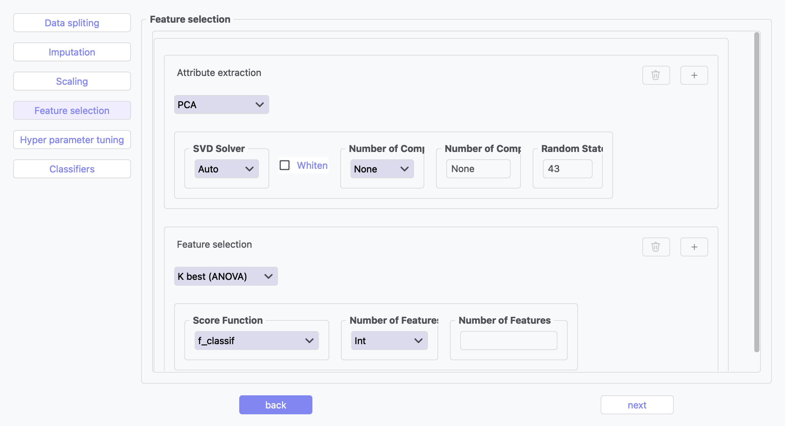

Classification
--------------

Overview
^^^^^^^^

.. image:: images/14.classification_imputation.png
   :alt: Classification Imputation
   :width: 100%

.. image:: images/14.classification_hyperparameter_tuning.png
   :alt: Classification Hyperparameter Tuning
   :width: 100%

The Classification tool provides multiple algorithms for data analysis with customizable parameters through an intuitive user interface.

Supported Algorithms
^^^^^^^^^^^^^^^^^^^^

**1. Logistic Regression Classifier**

A linear model for classification that predicts class probabilities.

**Key Parameters:**

* **Penalty**: Regularization type (L1, L2, Elasticnet, None)
* **Regularization Strength (C)**: Inverse of regularization strength (default: 1.0)
* **Solver**: Algorithm for optimization (lbfgs, liblinear, newton-cg, sag, saga)
* **Multi-class Option**: How to handle multi-class data (auto, ovr, multinomial)
* **Max Iterations**: Maximum iterations for solver (default: 100)
* **Random State**: Seed for reproducibility (default: 43)
* **Class Weight**: Balance classes by weights (None or 'balanced')

**2. K-Nearest Neighbors Classifier**

Non-parametric method using closest training examples.

**Key Parameters:**

* **Number of Neighbors**: K value for nearest neighbors
* **Weights**: How to weight neighbors (Uniform, Distance)
* **Distance Metric**: Method for calculating distances (euclidean, manhattan, etc.)
* **Algorithm**: Search method (Auto, Ball_tree, Kd_tree, Brute)

**3. Decision Tree Classifier**

Creates a model predicting targets by learning decision rules.

**Key Parameters:**

* **Criterion**: Function to measure split quality (gini, entropy, log_loss)
* **Max Depth**: Maximum depth of the tree
* **Min Samples Split**: Minimum samples required to split node
* **Min Samples Leaf**: Minimum samples required at leaf node
* **Class Weight**: Class weights (None, 'balanced')
* **Random State**: Seed for reproducibility (default: 43)

**4. Support Vector Machines (SVM)**

Finds optimal hyperplane to separate classes.

**Key Parameters:**

* **Kernel**: Kernel type (linear, poly, rbf, sigmoid)
* **Regularization Parameter (C)**: Regularization strength (default: 1.0)
* **Gamma**: Kernel coefficient for 'rbf', 'poly' and 'sigmoid' (scale, auto)
* **Degree**: Degree for poly kernel
* **Decision Function Shape**: Shape of decision function (ovr, ovo)
* **Class Weight**: Class weights (None, 'balanced')

**5. AdaBoost Classifier**

Ensemble method using weak classifiers on modified data versions.

**Key Parameters:**

* **Base Estimator**: Base estimator type (DecisionTreeClassifier, SVC, etc.)
* **Number of Estimators**: Boosting iterations (default: 50)
* **Learning Rate**: Weight applied to each classifier (default: 1.0)
* **Algorithm**: Boosting algorithm (SAMME, SAMME.R)
* **Random State**: Seed for reproducibility

**6. Bagging Classifier**

Ensemble using base classifiers on random data subsets.

**Key Parameters:**

* **Base Estimator**: Base estimator type (DecisionTreeClassifier, SVC, etc.)
* **Number of Estimators**: Number of base estimators (default: 10)
* **Max Samples**: Samples per base estimator (default: 1.0)
* **Max Features**: Features per base estimator (default: 1.0)
* **Bootstrap**: Whether to sample with replacement (True/False)
* **Random State**: Seed for reproducibility

**7. Naive Bayes (GaussianNB)**

Applies Bayes' theorem with feature independence assumption.

Classification Workflow
^^^^^^^^^^^^^^^^^^^^^^^

1. Select and configure algorithms
2. Apply preprocessing steps
3. Train models
4. Evaluate using standard metrics
5. Compare algorithm performance

Classification Pipeline
^^^^^^^^^^^^^^^^^^^^^^^

The Classification tool guides you through a complete machine learning workflow:

**1. Data Splitting**

* **Shuffle**: Enable shuffling to randomize the data before splitting
* **Split**: Choose between percentage split or K-fold cross-validation
* **Percentage**: Specify training data percentage (e.g., 80%)
* **K-fold**: Set the number of folds for cross-validation
* **Perform Final Test**: Option to reserve data for final testing

**2. Imputation**

* **Continuous Missing Value**: Strategy for handling missing numerical values
* **Categorical Missing Value**: Strategy for handling missing categorical values

**3. Scaling**

* **Standard Scaling**: Normalize data to mean of 0 and standard deviation of 1

**4. Feature Selection**

* **PCA**: Reduce features using Principal Component Analysis
* **K Best (ANOVA)**: Select top K features based on statistical tests

**5. Hyperparameter Tuning**

* **Grid Search**: Exhaustively search parameter combinations
