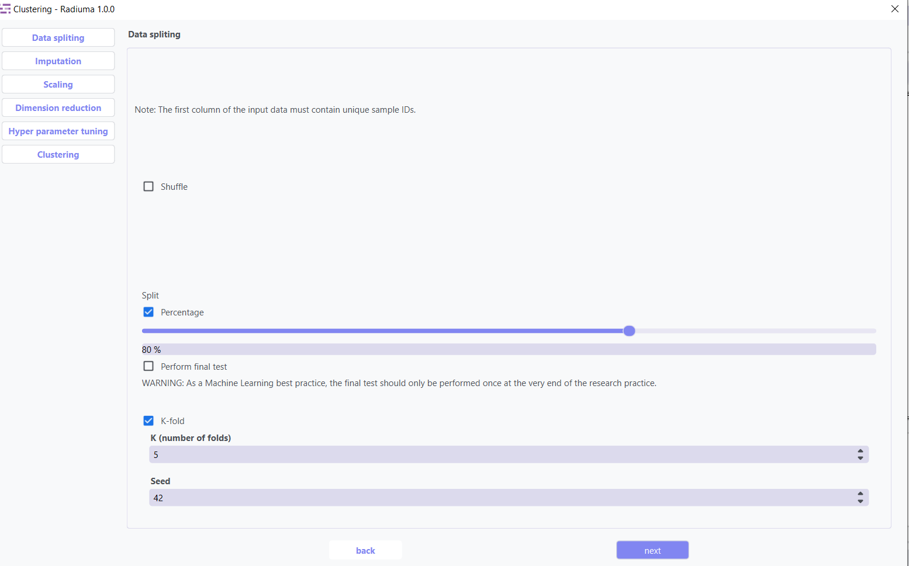
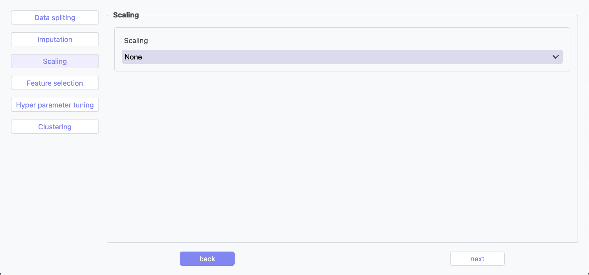
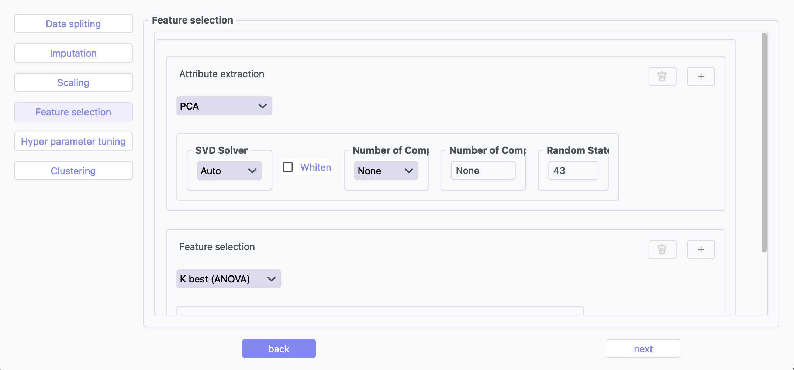
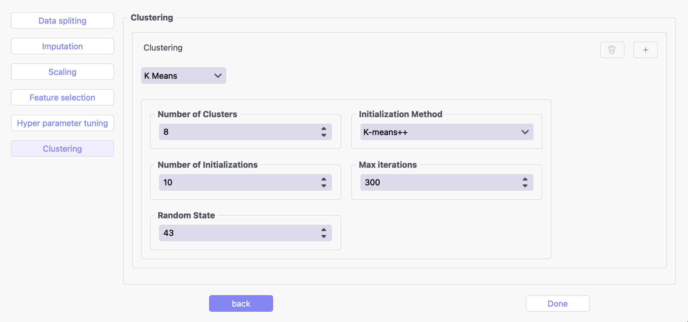

Clustering
----------

Overview
^^^^^^^^

The Clustering tool provides algorithms for grouping similar data points without labeled training data.

.. image:: images/16.clustering_imputation.png
   :alt: Clustering Imputation
   :width: 100%

The imputation step replaces missing values in your dataset with estimated values, ensuring clustering algorithms can process complete data. Methods include mean, median, or constant value imputation for numerical data and mode imputation for categorical variables.

Feature scaling standardizes your data features to equivalent ranges, which is crucial for distance-based clustering algorithms. Techniques like StandardScaler, MinMaxScaler, and RobustScaler ensure features contribute equally to similarity calculations regardless of their original scales.

Feature selection reduces dimensionality by identifying the most relevant attributes for cluster formation. This step improves computational efficiency, reduces noise, and enhances cluster definition by eliminating redundant or irrelevant variables that may obscure natural groupings.

Hyperparameter tuning optimizes algorithm-specific parameters like number of clusters, convergence thresholds, or distance metrics. This systematic search identifies the configuration that produces the most coherent and well-separated clusters for your specific dataset.

The algorithm selection interface allows you to choose from various clustering approaches based on your data characteristics and analytical goals. Each algorithm offers different strengths for discovering patterns in data with distinct distribution shapes, densities, and feature types.

Supported Algorithms
^^^^^^^^^^^^^^^^^^^^

**1. K-Means Clustering**

Partitions observations into k clusters with nearest mean.

**Key Parameters:**

* **Number of Clusters**: Number of clusters to form (default: 8)
* **Initialization Method**: Method for initialization (k-means++, random)
* **Number of Initializations**: Number of times to run with different initializations (default: 10)
* **Max Iterations**: Maximum iterations for a single run (default: 300)
* **Random State**: Seed for reproducible results (default: 42)

**2. Agglomerative Clustering**

Hierarchical approach building nested clusters.

**Key Parameters:**

* **Number of Clusters**: Number of clusters to find (default: 2)
* **Linkage**: Method for calculating distances between clusters (ward, complete, average, single)
* **Distance Metric**: Metric for calculating distances (euclidean, manhattan, etc.)
* **Compute Distances**: Whether to compute distances for visualization (default: False)

**3. K-Mode Clustering**

Specialized for categorical data.

**Key Parameters:**

* **Number of Clusters**: Number of clusters to form (default: 8)
* **Initialization Method**: Method for initial centroids (cao, random, Huang)
* **Number of Initializations**: Number of times to run with different initializations (default: 10)
* **Max Iterations**: Maximum iterations for a single run (default: 100)
* **Random State**: Seed for reproducible results (default: 42)

**4. Gaussian Mixture Model**

Probabilistic model assuming data from Gaussian distributions mixture.

**Key Parameters:**

* **Number of Components**: Number of mixture components (default: 1)
* **Covariance Type**: Type of covariance parameters (full, tied, diag, spherical)
* **Number of Initializations**: Number of times to run with different initializations (default: 1)
* **Max Iterations**: Maximum number of EM iterations (default: 100)
* **Initialization Parameters**: Method for initialization (kmeans, random)
* **Tolerance**: Convergence threshold (default: 0.01)
* **Random State**: Seed for reproducible results (default: 42)

**5. Spectral Clustering**

Uses eigenvalues of similarity matrix to reduce dimensions before clustering.

**Key Parameters:**

* **Number of Clusters**: Number of clusters to form (default: 8)
* **Eigen Solver**: Method for computing eigenvectors (arpack, lobpcg, amg)
* **Number of Components**: Number of eigenvectors to use
* **Number of Initializations**: Number of times k-means will be run (default: 10)
* **Gamma**: Kernel coefficient for rbf kernel
* **Number of Neighbors**: Number of neighbors for nearest neighbors graph
* **Assign Labels**: Method for assigning labels (kmeans, discretize)

**6. Mean Shift**

Non-parametric technique that finds dense areas of data points.

**Key Parameters:**

* **Max Iterations**: Maximum number of iterations (default: 300)

**7. Affinity Propagation**

Finds clusters by passing messages between data points.

**Key Parameters:**

* **Damping**: Damping factor to avoid numerical oscillations (default: 0.5)
* **Convergence Iterations**: Number of iterations with no change before convergence (default: 15)
* **Max Iterations**: Maximum number of iterations (default: 200)
* **Affinity**: Metric used to compute affinity between points (euclidean, precomputed)

Clustering Evaluation Metrics
^^^^^^^^^^^^^^^^^^^^^^^^^^^^^

* **Silhouette Score**: Measure of how similar objects are to their own cluster compared to other clusters
* **Davies-Bouldin Index**: Average similarity of each cluster with its most similar cluster
* **Calinski-Harabasz Index**: Ratio of between-cluster dispersion to within-cluster dispersion
* **Inertia**: Sum of squared distances of samples to their closest cluster center

Clustering Pipeline
^^^^^^^^^^^^^^^^^^^

The Clustering tool guides you through a complete workflow:

**   Data Requirement: The first column of the input data must contain unique sample IDs.

**1. Data Preprocessing**

* **Feature Scaling**: Standardize features to equal scale
* **Dimensionality Reduction**: Apply PCA or t-SNE before clustering
* **Categorical Encoding**: Convert categorical variables for distance-based algorithms

**2. Model Selection**

* **Algorithm Selection**: Choose appropriate clustering method based on data type
* **Parameter Tuning**: Optimize key parameters like number of clusters
* **Initialization Method**: Choose how to initialize cluster centers

**3. Cluster Evaluation**

* **Visualization**: Plot clusters in 2D/3D space
* **Validation**: Assess cluster quality using internal and stability metrics
* **Interpretation**: Analyze cluster characteristics and distributions
