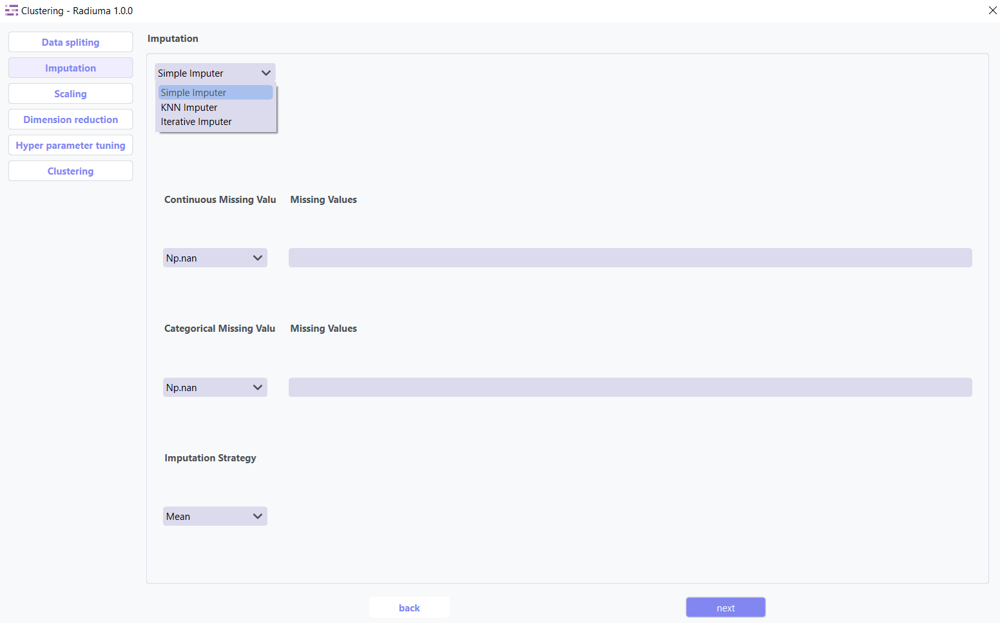
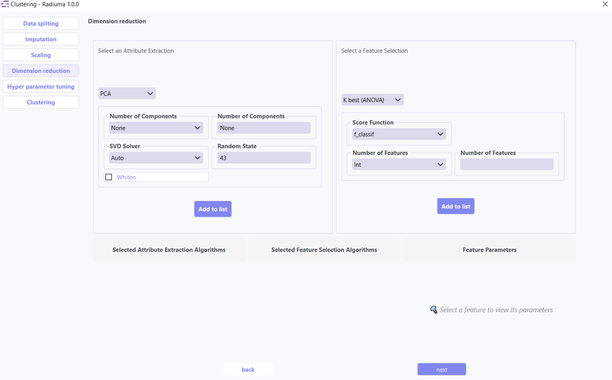

Clustering
----------

Overview
^^^^^^^^

.. image:: images/16.clustering.png    16.clustering_data
   :alt: Clustering
   :width: 100%

The Clustering tool provides algorithms for grouping similar data points without labeled training data.

Data Import
^^^^^^^^^^^

Before splitting or processing your data, ensure it is **properly structured**.

**Important Note :** 

* **Data Requirement**: The first column of the input data data must contain unique sample IDs.

Data Splitting
^^^^^^^^^^^^^^

**Data Splitting Options:**

* **Shuffle**: Enable shuffling to randomize the data before splitting
* **Split**: Choose between percentage split or K-fold cross-validation
* **Percentage**: Specify training data percentage (e.g., 80%)
* **K-fold**: Set the number of folds for cross-validation
* **Perform Final Test**: Option to reserve data for final testing

Imputation
^^^^^^^^^^

The imputation step addresses missing values in your dataset by replacing them with calculated values using three advanced strategies: **Simple Imputer, KNN Imputer, and Iterative Imputer**. Options include mean, median, or mode imputation for categorical data, ensuring your classification models have complete datasets for accurate predictions.

1. **Simple Imputer:** Basic replacement strategies for quick handling of missing data.

**Imputation Options:**

* **Continuous Missing Value**: Strategy for handling missing numerical values
* **Categorical Missing Value**: Strategy for handling missing categorical values

**Imputation Strategy:**

* **Mean**: Replace with feature mean
* **Median**: Replace with feature median
* **Most Frequent**: Replace with most common value
* **Constant**: Replace with user-specified value

2. **KNN Imputer:** Nearest-neighbor based imputation using feature similarity.

* **Key Parameters**:
   
* **n_neighbors** (default: 5) – Number of neighbors used to impute missing values
* **metric** – Distance function non-euclidean, 
* **weights** – uniform or distance (distance gives more weight to closer neighbors)

3. **Iterative Imputer:** Advanced method that models each feature with missing values as a function of other features.

* **Key Parameters**:

* **Estimator**  
  Algorithm used to predict missing values for each feature.  

  Common options include:

  - **BayesianRidge** *(default)* – Performs regularized linear regression using Bayesian principles  
  - **GaussianProcessRegressor** – Models non-linear relationships with probabilistic output  
  - **KernelRidge** – Combines ridge regression with kernel tricks for non-linear features  
  - **KNeighborsRegressor** – Uses neighboring samples to estimate missing values  
  - **LinearRegression** – Basic linear approach for imputation  
  - **Lasso / Ridge / ElasticNet** – Regularized linear models for better generalization

* **Imputation Order**  
  Determines the sequence in which features are imputed:

  - **Ascending** *(default)* – Start from features with fewest missing values  
  - **Descending** – Start from features with most missing values  
  - **Random** – Random order for each iteration  
  - **Roman** – Left-to-right (fixed order)

Scaling
^^^^^^^

.. image:: images/16.clustering_scaling.png
   :alt: Clustering Scaling
   :width: 100%

Dimention Reduction
^^^^^^^^^^^^^^^^^

Dimension reduction techniques optimize your dataset by identifying and retaining only the most valuable features. These methods serve two primary purposes:

1. **Attribute Extraction**: Transforms features into a more compact representation while preserving essential patterns
2. **Feature Selection**: Identifies and keeps only the most informative original features

Key Benefits:

   * Reduces computational requirements and training time
   * Improves model performance by eliminating noise
   * Helps prevent overfitting
   * Enhances interpretability of results

* **1. Attribute Extraction Algorithms**

Transform features into a lower-dimensional space while retaining patterns:

* **Available Methods**:

   * **PCA (Principal Component Analysis)**: Linear dimensionality reduction via orthogonal transformation
   * **Kernel PCA**: Non-linear extension of PCA using kernel functions
   * **Factor Analysis**: Models observed variables as linear combinations of latent factors
   * **FastICA**: Independent Component Analysis for signal separation
   * **Incremental PCA**: Efficient PCA for large, streaming datasets

* **2. Feature Selection Algorithms**

Select the most relevant features without transformation:

* **Available Methods**:

   * **K-Best(ANOVA)**: Select top k features based on statistical tests 
   * **Select Percentile**: Keep top features above a specified percentile
   * **ReliefF**: Weight-based feature selection for multi-class problems
   * **Variance Threshold**: Remove low-variance features (user-defined threshold)

Hyperparameter Tuning
^^^^^^^^^^^^^^^^^^^^

.. image:: images/16.clustering_hyperparameter_tuning.png
   :alt: Clustering Hyperparameter Tuning
   :width: 100%

Hyperparameter tuning optimizes algorithm-specific parameters like number of clusters, convergence thresholds, or distance metrics. This systematic search identifies the configuration that produces the most coherent and well-separated clusters for your specific dataset.

clustering Selection
^^^^^^^^^^^^^^^^^^^

The algorithm selection interface allows you to choose from various clustering approaches based on your data characteristics and analytical goals. Each algorithm offers different strengths for discovering patterns in data with distinct distribution shapes, densities, and feature types.

Supported Algorithms
^^^^^^^^^^^^^^^^^^^^

**1. K-Means Clustering**

Partitions observations into k clusters with nearest mean.

**Key Parameters:**

* **Number of Clusters**: Number of clusters to form (default: 8)
* **Initialization Method**: Method for initialization (k-means++, random)
* **Number of Initializations**: Number of times to run with different initializations (default: 10)
* **Max Iterations**: Maximum iterations for a single run (default: 300)
* **Random State**: Seed for reproducible results (default: 42)

**2. Agglomerative Clustering**

Hierarchical approach building nested clusters.

**Key Parameters:**

* **Number of Clusters**: Number of clusters to find (default: 2)
* **Linkage**: Method for calculating distances between clusters (ward, complete, average, single)
* **Distance Metric**: Metric for calculating distances (euclidean, manhattan, etc.)
* **Compute Distances**: Whether to compute distances for visualization (default: False)

**3. K-Mode Clustering**

Specialized for categorical data.

**Key Parameters:**

* **Number of Clusters**: Number of clusters to form (default: 8)
* **Initialization Method**: Method for initial centroids (cao, random, Huang)
* **Number of Initializations**: Number of times to run with different initializations (default: 10)
* **Max Iterations**: Maximum iterations for a single run (default: 100)
* **Random State**: Seed for reproducible results (default: 42)

**4. Gaussian Mixture Model**

Probabilistic model assuming data from Gaussian distributions mixture.

**Key Parameters:**

* **Number of Components**: Number of mixture components (default: 1)
* **Covariance Type**: Type of covariance parameters (full, tied, diag, spherical)
* **Number of Initializations**: Number of times to run with different initializations (default: 1)
* **Max Iterations**: Maximum number of EM iterations (default: 100)
* **Initialization Parameters**: Method for initialization (kmeans, random)
* **Tolerance**: Convergence threshold (default: 0.01)
* **Random State**: Seed for reproducible results (default: 42)

**5. Spectral Clustering**

Uses eigenvalues of similarity matrix to reduce dimensions before clustering.

**Key Parameters:**

* **Number of Clusters**: Number of clusters to form (default: 8)
* **Eigen Solver**: Method for computing eigenvectors (arpack, lobpcg, amg)
* **Number of Components**: Number of eigenvectors to use
* **Number of Initializations**: Number of times k-means will be run (default: 10)
* **Gamma**: Kernel coefficient for rbf kernel
* **Number of Neighbors**: Number of neighbors for nearest neighbors graph
* **Assign Labels**: Method for assigning labels (kmeans, discretize)

**6. Mean Shift**

Non-parametric technique that finds dense areas of data points.

**Key Parameters:**

* **Max Iterations**: Maximum number of iterations (default: 300)

**7. Affinity Propagation**

Finds clusters by passing messages between data points.

**Key Parameters:**

* **Damping**: Damping factor to avoid numerical oscillations (default: 0.5)
* **Convergence Iterations**: Number of iterations with no change before convergence (default: 15)
* **Max Iterations**: Maximum number of iterations (default: 200)
* **Affinity**: Metric used to compute affinity between points (euclidean, precomputed)

Clustering Evaluation Metrics
^^^^^^^^^^^^^^^^^^^^^^^^^^^^^

After training, Radiuma automatically computes standard clustering metrics:

* **Silhouette Score**: Measure of how similar objects are to their own cluster compared to other clusters
* **Davies-Bouldin Index**: Average similarity of each cluster with its most similar cluster
* **Calinski-Harabasz Index**: Ratio of between-cluster dispersion to within-cluster dispersion
* **Inertia**: Sum of squared distances of samples to their closest cluster center

Clustering Workflow
^^^^^^^^^^^^^^^^^^^

.. image:: images/16.clustering_workflow.png
   :alt: Classification
   :width: 80%

Clustering Pipeline
^^^^^^^^^^^^^^^^^^^

The Clustering tool guides you through a complete workflow:

**1. Data Preprocessing**

* **Feature Scaling**: Standardize features to equal scale
* **Dimensionality Reduction**: Apply PCA or t-SNE before clustering
* **Categorical Encoding**: Convert categorical variables for distance-based algorithms

**2. Model Selection**

* **Algorithm Selection**: Choose appropriate clustering method based on data type
* **Parameter Tuning**: Optimize key parameters like number of clusters
* **Initialization Method**: Choose how to initialize cluster centers

**3. Cluster Evaluation**

* **Visualization**: Plot clusters in 2D/3D space
* **Validation**: Assess cluster quality using internal and stability metrics
* **Interpretation**: Analyze cluster characteristics and distributions
