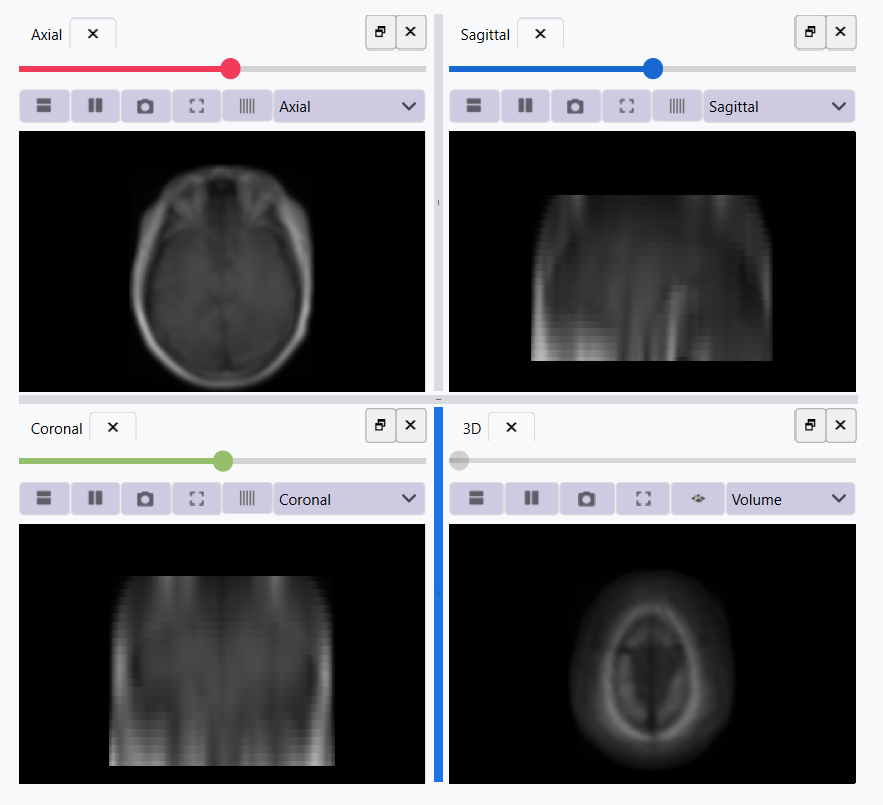

Examples
========

This section provides step-by-step guides for common tasks in Radiuma to help users get started quickly.

.. contents:: :local:

Image Conversion
----------------

The Image Conversion functionality allows users to easily convert medical images between different file formats, making it simple to work with various imaging systems and software.

How It Works
^^^^^^^^^^^^

1. **Image Reader Tool**: First, use the Image Reader to load your source images

   * Supports reading from individual files or entire folders
   * Compatible with NIFTI (.nii, .nii.gz), NRRD, and DICOM formats
   * Handles both single images and multi-file image series

2. **Writer Tool**: Then, connect the Writer tool to convert and save the images

   * Specify your desired output location
   * Choose the target format for conversion
   * Process individual files or batch convert entire directories

Workflow Integration
^^^^^^^^^^^^^^^^^^^^

To convert images:

1. Add an Image Reader tool to your workflow
2. Configure the Image Reader to load your source image(s)
3. Add a Writer tool to your workflow
4. Connect the output port of the Image Reader to the input port of the Writer
5. Configure the Writer with your desired output format and location
6. Run the workflow to perform the conversion

This simple two-step process allows for easy conversion of medical images between supported formats without specialized knowledge of file formats or conversion tools.

RT Struct Processing
--------------------

RT Structure Sets are critical for radiation therapy planning and analysis. Radiuma provides a straightforward workflow for importing and processing these specialized files.

How It Works
^^^^^^^^^^^^

1. **RT Struct Reader Tool**: Begin by loading your radiation therapy structure set

   * Requires both a main image and corresponding structure set labels
   * The name of RTSTRUCT single dicom file  must exactly match the name of the corresponding image folder.
   * RT Label Directory: Path to the RT structure set file
   * RT Main Image Directory: Path to the corresponding image data
   * Automatically extracts contours and segmentation information

2. **Writer Tool**: Connect to the Writer tool to save processed RT structures

   * Choose your desired output location
   * Select appropriate format for saving segmentation data
   * Preserve the relationship between images and their associated structures

Workflow Integration
^^^^^^^^^^^^^^^^^^^^

To process RT Struct files:

1. Add an RT Struct Reader tool to your workflow
2. Configure the RT Struct Reader with paths to both your main image and structure set labels
3. Add a Writer tool to your workflow
4. Connect the output port of the RT Struct Reader to the input port of the Writer
5. Configure the Writer with your desired output location and format
6. Run the workflow to complete the processing

This workflow enables efficient handling of radiation therapy planning data while maintaining the integrity of structure sets and their associated imaging.

Image Filtering
---------------

Image filtering is essential for enhancing specific features, reducing noise, and preparing images for analysis. Radiuma provides several standardized filters that comply with IBSI guidelines.

How It Works
^^^^^^^^^^^^

1. **Image Reader Tool**: Start by loading the medical image you want to filter

   * Select your source image file or directory
   * The tool supports NIFTI, NRRD, and DICOM formats

2. **Filter Tool**: Apply one or more filters to the input image

   * **Mean Filter**: Smooths images by replacing each pixel with the average of its neighborhood
   * **LoG (Laplacian of Gaussian)**: Highlights edges and regions of rapid intensity change
   * **Laws Filter**: Extracts texture features using small convolution kernels
   * **Gabor Filter**: Identifies texture and directional features at various scales
   * **Wavelet Filter**: Performs multi-resolution analysis for feature extraction

3. **Writer Tool**: Save the filtered image to your desired location

   * Select output location and format
   * Preserve metadata from the original image

Customizable Parameters
^^^^^^^^^^^^^^^^^^^^^^^

Each filter provides adjustable parameters to fine-tune the results:

* **Mean Filter**: Kernel size, boundary handling
* **LoG Filter**: Sigma value, kernel size
* **Laws Filter**: Kernel type, window size
* **Gabor Filter**: Frequency, orientation, bandwidth
* **Wavelet Filter**: Wavelet family, decomposition level, boundary handling

Workflow Integration
^^^^^^^^^^^^^^^^^^^^

To filter medical images:

1. Add an Image Reader tool to your workflow
2. Configure the Image Reader to load your source image
3. Add a Filter tool to your workflow
4. Connect the output port of the Image Reader to the input port of the Filter
5. Select the desired filter type and adjust parameters
6. Add a Writer tool to your workflow
7. Connect the output port of the Filter to the input port of the Writer
8. Configure the Writer with your desired output location and format
9. Run the workflow to apply the filter and save the results

For example, we can apply a Mean filter to the image to smooth the image. We set params to this:

The image before filtering is:

The image after filtering is:

This workflow enables precise control over image enhancement techniques while maintaining compatibility with downstream analysis tools.

Image Fusion
------------

Image fusion combines information from multiple images into a single composite image, preserving the most important visual information from each source. This is particularly useful for integrating complementary data from different imaging modalities or acquisition times.

How It Works
^^^^^^^^^^^^

1. **Image Reader Tool**: Load the images you want to fuse

   * You'll need two separate Image Reader tools, one for each input image
   * Both images should have compatible dimensions for proper fusion

* **important:**

   Each fusion method contains a **Normalization** tab that must be configured before processing. 
   Proper normalization ensures correct fusion results by matching intensity ranges between images.

Before applying any fusion method, normalization is required to ensure proper scaling and comparable intensity ranges between input images.

**Key Parameters**

* **Normalization Method**:

  - `MinMax`: Scales data to a specified range (default: [0, 1])
  - `ZScore`: Standardizes data to have zero mean and unit variance

2. **Image Fusion Tool**: Combine the images using one of three fusion methods

   * **Weighted Fusion**: Linear combination of input images
     * Weight 1: Contribution of first image (0-1)
     * Weight 2: Contribution of second image (0-1)
     * Interpolation: Method for combining images (Linear, Cubic, etc.)
   
   * **Wavelet Fusion**: Multi-resolution decomposition and fusion
     * Fusion Method: Algorithm for combining wavelet coefficients (Max, Min, Mean)
     * Level: Decomposition level for wavelet transform
     * Mode: Signal extrapolation mode
     * Wavelet: Wavelet family to use (Haar, etc.)
   
   * **PCA Fusion**: Principal Component Analysis based fusion
     * Number of Components: Components to use in reconstruction
     * SVD Solver: Algorithm for Singular Value Decomposition
     * Components: Number of principal components

3. **Writer Tool**: Save the fused image to your desired location

   * Select output location and format
   * Preserve metadata from the original images

Workflow Integration
^^^^^^^^^^^^^^^^^^^^

To fuse medical images:

1. Add two Image Reader tools to your workflow
2. Configure each Image Reader to load one of your source images
3. Add an Image Fusion tool to your workflow
4. Connect the output ports of both Image Readers to the input ports of the Image Fusion tool
5. Select the desired fusion method and adjust its parameters
6. Add a Writer tool to your workflow
7. Connect the output port of the Image Fusion tool to the input port of the Writer
8. Configure the Writer with your desired output location and format
9. Run the workflow to perform the fusion and save the results

.. image:: images/17.Example_image_fusion.png
   :alt: Image Fusion Workflow
   :width: 600px

This workflow allows you to combine complementary information from different imaging sources into a single comprehensive visualization for improved analysis and interpretation.

Image Registration for AutoPET
------------------------------

Image registration is a crucial step in medical image analysis, especially for multimodal imaging like PET/CT. This example demonstrates how to register PET and CT images from AutoPET datasets.

How It Works
^^^^^^^^^^^^

1. **Image Reader Tool (Fixed Image)**: Load the CT image as the fixed (reference) image

   * Configure the reader to point to your CT data source
   * CT scans typically provide detailed anatomical information

2. **Image Reader Tool (Moving Image)**: Load the PET image as the moving image to be aligned

   * Configure the reader to point to your PET data source
   * PET scans provide functional or metabolic information

3. **Image Registration Tool**: Align the PET (moving) image to the CT (fixed) image

   * **Rigid Registration**: Maintains shape and size, only allows rotation and translation
     * Number of Histogram Bins: Controls the granularity of intensity matching
     * Sampling Method: Determines how points are sampled during registration
     * Learning Rate: Controls the optimization step size
     * Number of Iterations: Sets the maximum number of optimization steps
     * Interpolation: Method used for interpolating between voxels
   
   * **Non-Rigid Registration**: Allows local deformations for better alignment of soft tissues
     * Transform Type: Typically BSplineTransform for PET/CT registration
     * Number of Iterations: Controls the optimization process
     * Final Grid Spacing: Determines the density of the deformation field

4. **Writer Tool**: Save the registered PET image

   * Select output location and format
   * The registered image will be aligned to the anatomical reference of the CT image

Workflow Integration
^^^^^^^^^^^^^^^^^^^^

To register AutoPET images:

1. Add an Image Reader tool for the fixed (CT) image
2. Configure the first Image Reader to load your CT image
3. Add a second Image Reader tool for the moving (PET) image
4. Configure the second Image Reader to load your PET image
5. Add an Image Registration tool to your workflow
6. Connect the output port of the CT Image Reader to the "fix image" input port of the Image Registration tool
7. Connect the output port of the PET Image Reader to the "moving image" input port of the Image Registration tool
8. Select the appropriate registration type and parameters based on your data
9. Add a Writer tool to your workflow
10. Connect the output port of the Image Registration tool to the input port of the Writer
11. Configure the Writer with your desired output location and format
12. Run the workflow to perform the registration and save the results

This registration workflow enables accurate spatial alignment of functional PET data with anatomical CT data, which is essential for proper localization and quantification of metabolic activity in cancer studies.

PET/CT Registration and Fusion
------------------------------

This advanced workflow combines both registration and fusion techniques to create comprehensive visualizations from multimodal AutoPET data. The workflow aligns PET images to CT images and then fuses them to combine functional and anatomical information.

How It Works
^^^^^^^^^^^^

1. **Image Reader Tool (CT)**: Load the CT image which serves dual purposes:

   * Acts as the fixed (reference) image for registration
   * Provides anatomical information for the fusion process (Image 2)

2. **Image Reader Tool (PET)**: Load the PET image as the moving image to be aligned

   * The PET data contains functional/metabolic information
   * Will be spatially registered to match the CT reference frame

3. **Image Registration Tool**: Align the PET image to the CT reference

   * Uses either rigid or non-rigid registration depending on requirements
   * Produces a spatially aligned PET image that matches the CT coordinate system

4. **Image Fusion Tool**: Combine the registered PET with the original CT

   * **Input 1**: Registered PET image (from registration tool)
   * **Input 2**: Original CT image (directly from CT Image Reader)
   * Creates a single composite image highlighting both structure and function

5. **Writer Tool**: Save the fused image for further analysis

   * Preserves both anatomical context and metabolic information
   * Can be saved in various formats for use in clinical or research contexts

Workflow Integration
^^^^^^^^^^^^^^^^^^^^

To implement this PET/CT registration and fusion pipeline:

1. Add two Image Reader tools to your workflow:
   * One for the CT image
   * One for the PET image

2. Configure both Image Readers to load the appropriate data

3. Add an Image Registration tool and connect:
   * CT Image Reader output → "fix image" input
   * PET Image Reader output → "moving image" input

4. Configure registration parameters appropriate for PET/CT alignment:
   * For most applications, rigid registration with appropriate histogram bins
   * For soft tissue focus, consider non-rigid registration

5. Add an Image Fusion tool and connect:
   * Registration tool output → "Image 1" input 
   * CT Image Reader output → "Image 2" input

6. Configure fusion parameters:
   * For clinical viewing, weighted fusion with customized color maps
   * For feature analysis, consider PCA or wavelet fusion

7. Add a Writer tool and connect:
   * Fusion tool output → Writer input

8. Configure the Writer with your desired output location and format

9. Run the workflow to register, fuse, and save the results

This integrated workflow creates comprehensive visualizations that preserve the metabolic sensitivity of PET while maintaining the anatomical detail of CT, which is particularly valuable for tumor localization, treatment planning, and response assessment in oncology applications.

This is the PET image:

This is the CT image:

This is the fusion of the Registered PET and CT images:

PET/CT Registration and Filtering
---------------------------------

This workflow combines registration and filtering techniques to enhance specific features in multimodal AutoPET data. The workflow first aligns PET images to CT images and then applies filters to enhance particular features of interest in the registered images.

How It Works
^^^^^^^^^^^^

1. **Image Reader Tool (CT)**: Load the CT image as the fixed (reference) image

   * Provides the anatomical reference frame
   * CT scans offer detailed structural information

2. **Image Reader Tool (PET)**: Load the PET image as the moving image

   * Contains functional/metabolic information
   * Will be spatially aligned to match the CT reference frame

3. **Image Registration Tool**: Align the PET image to the CT reference

   * Uses either rigid or non-rigid registration depending on requirements
   * Ensures the metabolic activity is precisely localized to anatomical structures

4. **Image Filter Tool**: Apply selected filters to the registered PET image

   * Enhances specific features of interest
   * Reduces noise or highlights particular characteristics
   * Available filters include Gabor, Wavelet, Threshold, Gradient, and Smoothing

5. **Writer Tool**: Save the filtered registered image

   * Preserves the spatial alignment with anatomical structures
   * Enhanced features are ready for further analysis

Workflow Integration
^^^^^^^^^^^^^^^^^^^^

To implement this PET/CT registration and filtering pipeline:

1. Add two Image Reader tools to your workflow:
   * One for the CT image
   * One for the PET image

2. Configure both Image Readers to load the appropriate data

3. Add an Image Registration tool and connect:
   * CT Image Reader output → "fix image" input
   * PET Image Reader output → "moving image" input

4. Configure registration parameters appropriate for PET/CT alignment:
   * For most applications, rigid registration is sufficient
   * For areas with tissue deformation, consider non-rigid registration

5. Add an Image Filter tool and connect:
   * Registration tool output → Filter input 

Reading a DICOM Series
----------------------

Medical images are often stored in the DICOM format, which can be easily imported into Radiuma for analysis:

1. **Add Image Reader Tool**
   - Double-click on the "Image Reader" tool in the left panel
   - A new node will appear in the workspace

2. **Configure Tool**
   - Double-click on the Image Reader node to open its configuration dialog
   - Select "Folder" as the Source Type
   - Click "Browse" and navigate to your DICOM directory
   - Click "OK" to confirm

3. **Run the Tool**
   - Click the "Run" button on the Image Reader node
   - The tool will process the DICOM files and make them available for other tools
   - Status information appears in the log panel at the bottom

4. **Visualize the Image**
   - Add an "Image Viewer" tool to the workspace
   - Connect the output port of the Image Reader to the input port of the Image Viewer
   - Run the Image Viewer tool to display the images
   - Use the viewer toolbox for panning, zooming, and adjusting window/level settings

Radiomics and Classification
----------------------------

This workflow demonstrates how to extract radiomic features from medical images and use machine learning classification to analyze those features for diagnostic or prognostic purposes.

How It Works
^^^^^^^^^^^^

1. **Image Reader Tool**: Load the medical image containing regions of interest

   * Configure the reader to load your source image (CT, MRI, PET, etc.)
   * This image provides the intensity values for feature extraction

2. **Image Filter Tool**: Apply preprocessing filters to enhance features of interest

   * Select appropriate filters based on the analysis goals
   * Enhance specific image characteristics that may correlate with clinical outcomes
   * Common options include Wavelet or LoG filters to highlight textural patterns

3. **Radiomic Feature Generator**: Extract quantitative features from the filtered image

   * Requires both the filtered image and a segmentation mask defining regions of interest
   * Calculates a comprehensive set of standardized radiomic features
   * Features can include first-order statistics, shape features, and texture metrics
   * Configure appropriate discretization parameters based on your imaging modality

4. **Classification Tool**: Apply machine learning to analyze radiomic features

   * Uses extracted features to train a classification model
   * Supports multiple algorithm options:
     * Logistic Regression: Linear model for probabilistic classification
     * Support Vector Machines: Effective for high-dimensional feature spaces
     * Random Forest: Ensemble method robust to overfitting
     * Neural Networks: Deep learning approach for complex relationships
   * Includes options for cross-validation and performance evaluation

5. **Writer Tool**: Save classification results and model performance metrics

   * Export classification results in tabular format (CSV, Excel)
   * Save performance metrics like accuracy, sensitivity, specificity, and AUC
   * Option to export the trained model for future predictions

Workflow Integration
^^^^^^^^^^^^^^^^^^^^

To implement this radiomics and classification pipeline:

1. Add an Image Reader tool to your workflow
   * Configure it to load your medical image

2. Add an Image Filter tool and connect:
   * Image Reader output → Filter input
   * Configure appropriate filter parameters

3. Add a Radiomic Feature Generator tool and connect:
   * Filter tool output → "Image" input
   * Connect a segmentation mask to the "Mask" input
   * Configure feature extraction parameters 

4. Add a Classification tool and connect:
   * Radiomic Feature Generator output → Classification input
   * Select your preferred classification algorithm
   * Configure training parameters and cross-validation options

5. Add a Writer tool and connect:
   * Classification tool output → Writer input
   * Configure to save results in your preferred format

6. Run the workflow to extract features, train the classifier, and save results

This workflow enables quantitative image analysis for applications such as tumor classification, treatment response prediction, and outcome prognostication based on imaging biomarkers.

Multi-Registration Regression Analysis
--------------------------------------

This workflow demonstrates how to combine multiple registration steps, image fusion, and radiomics analysis for building regression models that can predict continuous outcomes from medical images.

How It Works
^^^^^^^^^^^^

1. **First Registration Step**: Align a primary image with an anatomical reference

   * Requires two input images: fixed (reference) and first moving image
   * Creates spatial alignment between different imaging series or timepoints
   * Uses appropriate registration parameters for the specific imaging modalities

2. **Second Registration Step**: Align a secondary image with the same reference

   * Uses the same fixed reference image as the first registration
   * Aligns a second moving image (e.g., different modality or timepoint)
   * Ensures all images exist in the same spatial reference frame

3. **Image Fusion Tool**: Combine information from both registered images

   * Fuses the two registered images into a single comprehensive visualization
   * Preserves complementary information from each registered image
   * Creates a multiparametric representation of the anatomy or pathology

4. **Radiomic Feature Generator**: Extract quantitative features from the fused image

   * Calculates standardized features from the fused image
   * Uses appropriate segmentation mask to define regions of interest
   * Extracts features that capture the combined information from both modalities

5. **Regression Tool**: Build predictive models for continuous outcomes

   * Uses radiomic features as input variables
   * Supports multiple regression algorithms:
     * Linear Regression: For linear relationships
     * Ridge/Lasso Regression: For models with regularization
     * Support Vector Regression: For non-linear relationships
     * Random Forest Regression: For complex feature interactions
   * Includes options for model validation and performance metrics

6. **Writer Tool**: Save regression results and model performance

   * Export prediction results and calculated features
   * Save performance metrics like R-squared, MAE, and RMSE
   * Option to export the trained model for future predictions

Workflow Integration
^^^^^^^^^^^^^^^^^^^^

To implement this multi-registration regression pipeline:

1. Add three Image Reader tools to your workflow:
   * One for the fixed reference image
   * One for the first moving image
   * One for the second moving image

2. Add the first Image Registration tool and connect:
   * Fixed reference image → "fix image" input
   * First moving image → "moving image" input
   * Configure appropriate registration parameters

3. Add the second Image Registration tool and connect:
   * Same fixed reference image → "fix image" input
   * Second moving image → "moving image" input
   * Configure appropriate registration parameters

4. Add an Image Fusion tool and connect:
   * First registration output → "Image 1" input
   * Second registration output → "Image 2" input
   * Configure fusion parameters appropriate for your analysis

5. Add a Radiomic Feature Generator tool and connect:
   * Fusion tool output → "Image" input
   * Connect a segmentation mask to the "Mask" input
   * Configure feature extraction parameters

6. Add a Regression tool and connect:
   * Radiomic Feature Generator output → Regression input
   * Select your preferred regression algorithm
   * Configure model parameters and validation options

7. Add a Writer tool and connect:
   * Regression tool output → Writer input
   * Configure to save results in your preferred format

8. Run the workflow to perform registrations, fusion, feature extraction, and regression modeling

This advanced workflow enables quantitative prediction of continuous outcomes such as survival time, treatment response measurements, or physiological parameters based on multimodal imaging biomarkers.

Radiomics-Based Clustering
--------------------------

This workflow demonstrates how to use unsupervised clustering techniques to discover natural groupings within radiomic features extracted from medical images.

How It Works
^^^^^^^^^^^^

1. **Image Registration Tool**: Align images for consistent spatial reference

   * Register images from different timepoints or modalities
   * Ensures all subsequent analysis occurs in the same spatial reference frame
   * Use appropriate registration parameters for your specific imaging modalities

2. **Radiomic Feature Generator**: Extract quantitative features from registered images

   * Calculates a comprehensive set of standardized radiomic features
   * Features typically include intensity statistics, shape metrics, and texture patterns
   * Uses appropriate segmentation mask to define regions of interest
   * Configure parameters based on your specific imaging modality

3. **Clustering Tool**: Apply unsupervised learning to discover patterns

   * Uses radiomic features as input variables
   * Supports multiple clustering algorithms:
     * K-Means: Partitions observations into k clusters with nearest mean
     * Agglomerative Clustering: Hierarchical approach building nested clusters
     * K-Mode Clustering: Specialized for categorical data
     * Gaussian Mixture Model: Probabilistic model for distribution mixtures
   * Includes options for determining optimal cluster numbers and visualization

4. **Writer Tool**: Save clustering results and visualizations

   * Export cluster assignments and feature data
   * Save cluster visualization plots and statistics
   * Generate reports on cluster characteristics and distributions

Workflow Integration
^^^^^^^^^^^^^^^^^^^^

To implement this radiomics-based clustering pipeline:

1. Add an Image Registration tool to your workflow
   * Configure the tool with appropriate fixed and moving images
   * Set registration parameters based on your specific application

2. Add a Radiomic Feature Generator tool and connect:
   * Registration tool output → "Image" input
   * Connect a segmentation mask to the "Mask" input
   * Configure feature extraction parameters appropriate for your analysis

3. Add a Clustering tool and connect:
   * Radiomic Feature Generator output → Clustering input
   * Select your preferred clustering algorithm
   * Configure algorithm parameters and evaluation metrics

4. Add a Writer tool and connect:
   * Clustering tool output → Writer input
   * Configure to save results in your preferred format

5. Run the workflow to perform registration, feature extraction, clustering analysis, and save results

This workflow is valuable for discovering natural subgroups within imaging data, potentially identifying previously unknown disease subtypes, patient stratification groups, or distinct tissue characteristics that may have clinical significance.
