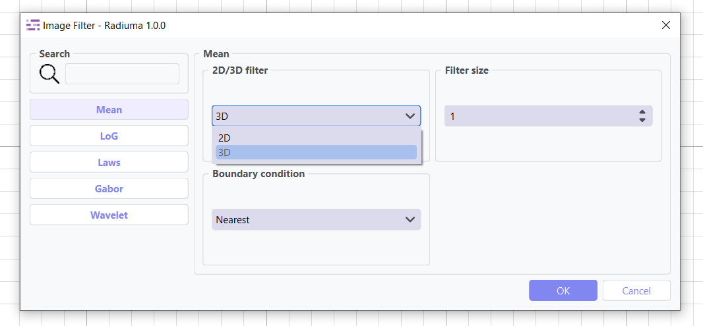
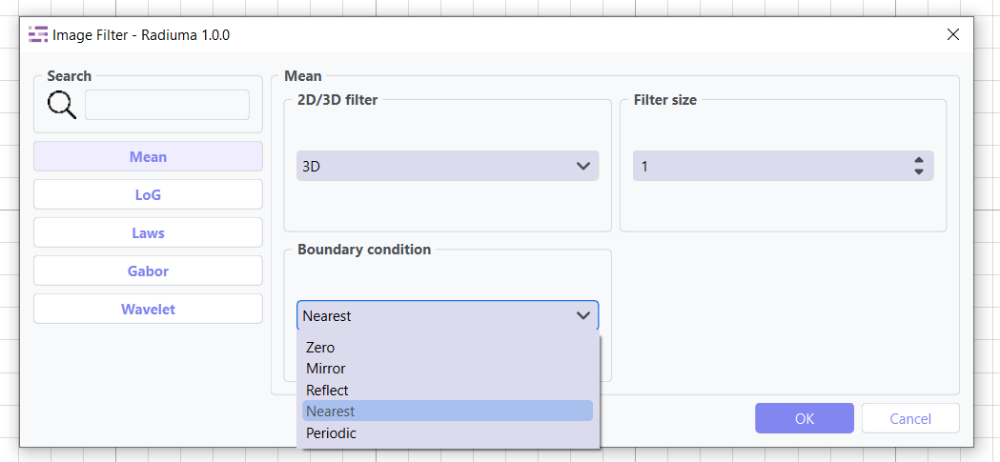
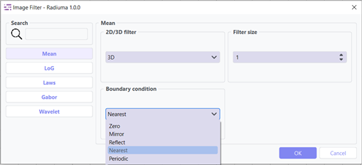
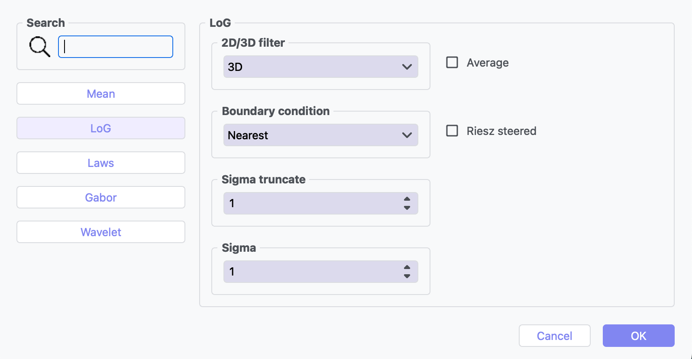
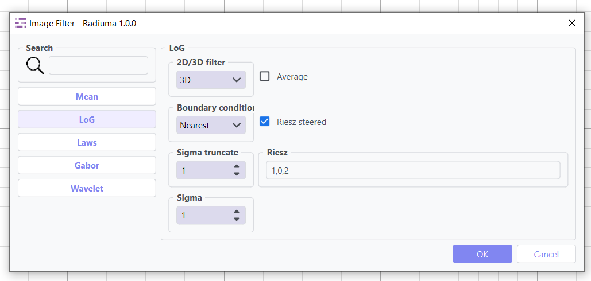
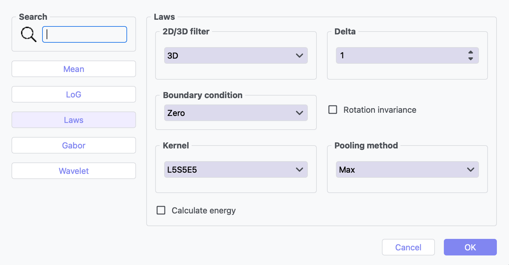
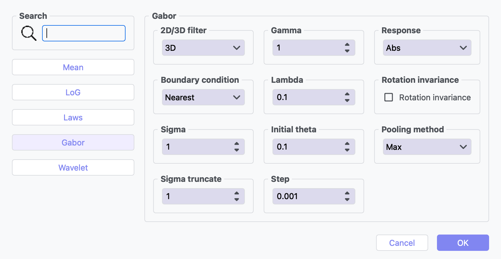
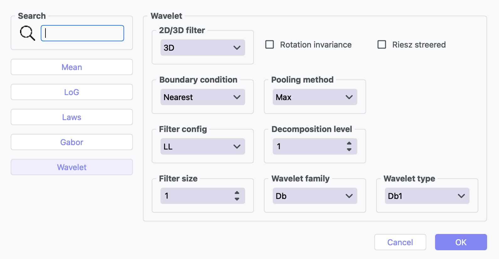
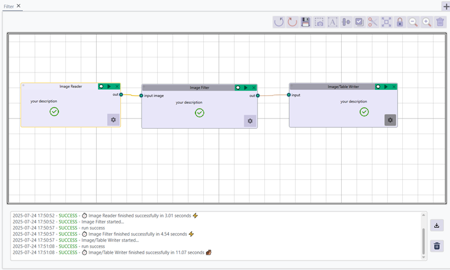

Image Filter
------------

   
Comprehensive set of image filtering options for enhancing features, reducing noise, and preparing images for feature extraction.  
Supports 2D or 3D filtering modes with customizable boundary conditions (e.g.,  Zero, Mirror, Nearest, Reflect, Priodic).

Mean Filter
^^^^^^^^^^^^

Mean Filter Smooths images by reducing noise while preserving edges.

**Key Parameters**

* **Filter Size**: Size of the kernel for mean calculation (default: 1)

LoG (Laplacian of Gaussian) Filter
^^^^^^^^^^^^

LoG Filter Highlights edges and regions of rapid intensity change.

**Key Parameters**

* **Sigma**: Scale parameter for Gaussian (default: 1)  
* **Sigma Truncate**: Truncation factor for Gaussian kernel (default: 1)  
* **Calculate Average**: Whether to calculate average in filter (default: False)  
* **Riesz Steered**: Apply Riesz transform (default: False)  
* **Riesz Parameters**: Parameters for Riesz transform (default: "1,0,2")

Laws Filter
^^^^^^^^^^^^

Laws Filter extracts texture features using small convolution kernels. Below are the available 2D and 3D kernels used in the Laws Filter for texture analysis.

**Key Parameters**

* **Kernel**: Specific Laws kernel to apply (default: "L5S5")

   .. image:: images/11.image_filter_laws_2D.png
      :alt:  Laws Filter
      :width: 100%  

   **2D Kernels**:

   * `L5S5` (Level + Spot, default)

   * `L5E5` (Level + Edge)

   * `L5W5` (Level + Wave)

   * `L5R5` (Level + Ripple)

   * `E5S5` (Edge + Spot)

   * `E5L5` (Edge + Level)

   * `S5L5` (Spot + Level)

   * `S5e5` (Spot + Edge)

   * `R5L5` (Ripple + Level)

   * `W5E5` (Wave + Edge)

   .. image:: images/11.image_filter_laws_3D.png
      :alt:  Laws Filter
      :width: 100%

   **3D Kernels**:

   * `L5S5E5` (Level + Spot + Edge, default)

   * `E5L5S5` (Edge + Level + Spot)

   * `L3W5R5` (Level-3 + Wave + Ripple)

   * `L5E5S5` (Level + Edge + Spot)

   * `L3W5S5` (Level-3 + Wave + Spot)

   * `S5L5E5` (Spot + Level + Edge)

   * `E5S5L5` (Edge + Spot + Level )

   * `L5S5W5` (Level + Spot + Wave)

   * `L5E5R5` (Level + Edge + Ripple)

   * `L5E5W5` (Level + Edge + Wave)

   * `L5E5R5` (Level + Edge + Spot)

* **Calculate Energy**: Calculate energy statistics (default: False)  
* **Delta**: Step size parameter (default: 1)  
* **Rotation Invariance**: Enable rotation invariance (default: False)  
* **Pooling Method**: Method for combining filter responses (default: "Max")

Gabor Filter
^^^^^^^^^^^^

Gabor Filter Texture and edge detection at various orientations and scales.

**Key Parameters**

* **Gamma**: Controls filter shape (default: 1)  
* **Lambda**: Wavelength of sinusoidal factor (default: 0.1)  
* **Theta Initial**: Starting orientation of filter (default: 0.1)  
* **Step**: Increment value for filter application (default: 0.001)  
* **Response**: Type of filter response (default: "Abs")  
* **Rotation Invariance**: Enable rotation invariance (default: False)  
* **Pooling Method**: Method for combining filter responses (default: "Max")  
* **Sigma**: Sigma value for Gabor kernel (default: 1)  
* **Sigma Truncate**: Truncation factor for Gaussian kernel (default: 1)

Wavelet Filter
^^^^^^^^^^^^

Wavelet Filter Multi-scale analysis for feature extraction.

**Key Parameters**

* **Filter Configuration**: Specific wavelet decomposition level to use (default: "LL")  
* **Filter Size**: Size of the filter kernel (default: 1)  
* **Rotation Invariance**: Enable rotation invariance (default: False)  
* **Pooling Method**: Method for combining filter responses (default: "Max")  
* **Decomposition Level**: Number of wavelet transform levels (default: 1)  
* **Wavelet Family**: Type of wavelet (default: "Db")  
* **Wavelet Type**: Specific wavelet implementation (default: "Db1")  
* **Riesz Steered**: Apply Riesz transform (default: False)  
* **Riesz Parameters**: Parameters for Riesz transform (default: "1,0,2")

Common Parameters
^^^^^^^^^^^^^^^^^^

* **Slice/Volume Processing**: 2D or 3D filtering  
* **Boundary Condition**: Handling of image boundaries (Nearest, Zero, etc.)

Workflow Integration
^^^^^^^^^^^^^^^^^^^^

* Takes image input
* Applies selected filtering techniques
* Outputs filtered image for further processing
