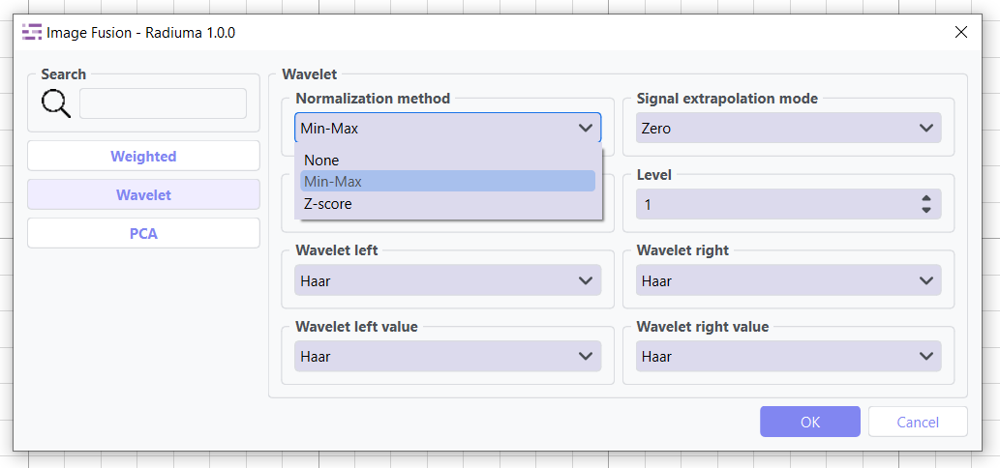
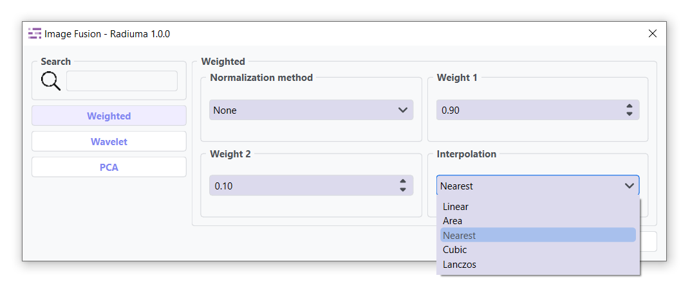
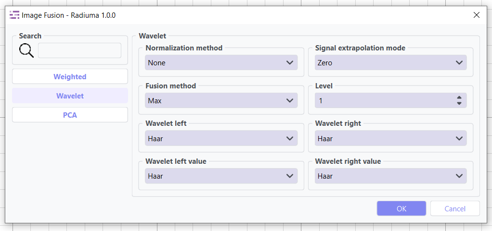
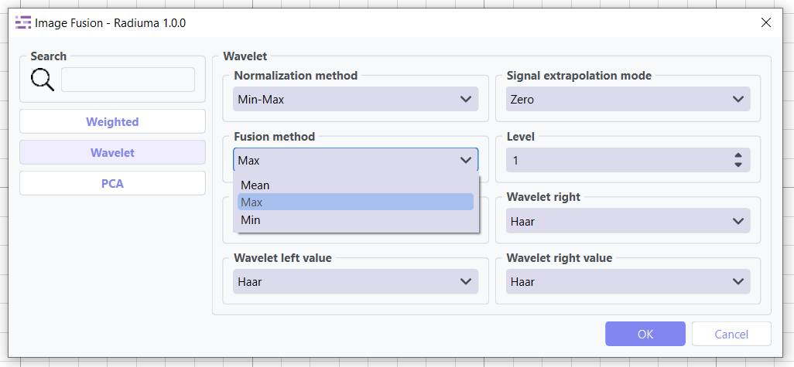
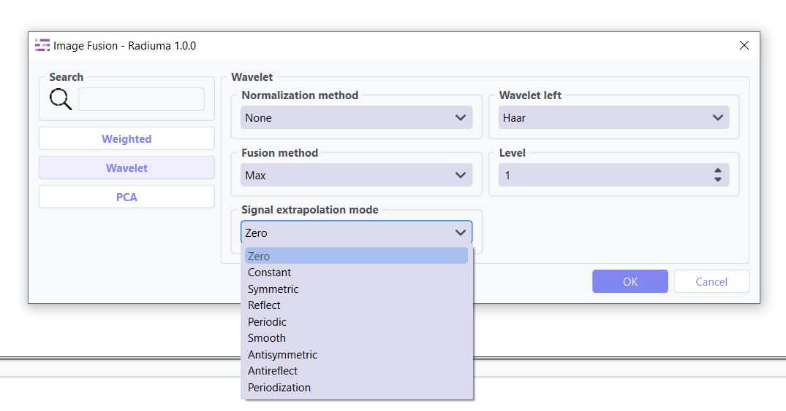
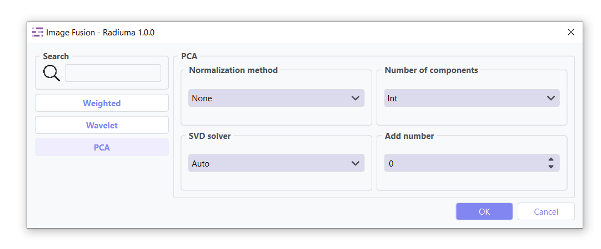
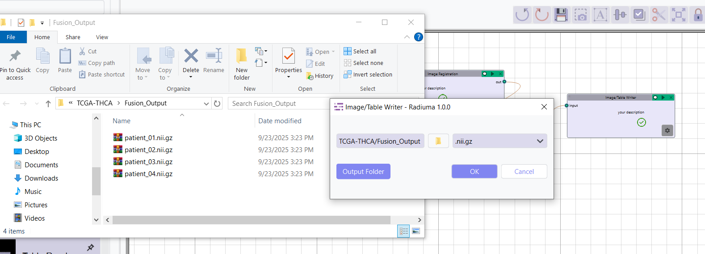

Image Fusion
------------

.. image:: images/12.image_fusion.png
   :alt: Image Fusion
   :width: 100%

**Image Fusion** is a Multi-Modality Integration for Enhanced Analysis. It combines information from multiple imaging modalities to create comprehensive representations that leverage the strengths of each input. This powerful technique addresses key clinical and research challenges by integrating complementary data sources, enabling more accurate analysis and interpretation.

**Key Benefits:**

* **Enhanced Diagnosis**: Fuse anatomical (CT/MRI) with functional (PET) data for precise lesion analysis
* **Complete Visualization**: View structural, metabolic and functional information in unified images  
* **Better Treatment Planning**: Improve target delineation for radiotherapy and surgery
* **Comprehensive Data**: Overcome individual modality limitations through integration

* **important Note:**

   Each fusion method contains a **Normalization** tab that must be configured before processing. 
   Proper normalization ensures correct fusion results by matching intensity ranges between images.

Before applying any fusion method, normalization is required to ensure proper scaling and comparable intensity ranges between input images.

**Key Parameters**

* **Normalization Method**:

  - `MinMax`: Scales data to a specified range (default: [0, 1])
  - `ZScore`: Standardizes data to have zero mean and unit variance

Weighted Fusion
^^^^^^^^^^^^^^^

.. image:: images/12.image_fusion.png
   :alt: Weighted Fusion 
   :width: 100%

Combines input images using a linear weighted sum. Ideal for blending anatomical and functional images with controlled emphasis.

**Key Parameters**

* **Weight 1**: Weight for the first input image (range: 0–1)  
* **Weight 2**: Weight for the second input image (range: 0–1)  
* **Interpolation**: Method for interpolating between images (`Linear`, `Area` ,`Nearest` , `Cubic`, `Lanzos`.)(default: `Nearest`) 

Wavelet Fusion
^^^^^^^^^^^^^^

Uses wavelet transform to perform multi-resolution decomposition and fusion of images, preserving fine details.

**Key Parameters**

* **Wavelet**: Wavelet family to use (e.g., `Haar`, `Db`,`Sym`, `Coif`, `Bior`, `Rbio`, `Dmey`.)(default: `Haar`) 

* **Fusion Method**: Algorithm for combining wavelet coefficients (`Max`, `Min`, `Mean`)  (default: `Max`).

* **Mode**: Signal extrapolation mode (e.g., `Zero`,`Constant`,`symmetric`,`Reflect`,`Periodic`, `Smooth`, `Antisymmetric`,`Antireflect`,`Periodization`.)  (default:Zero)

* **Level**: Number of decomposition levels  

PCA Fusion
^^^^^^^^^^

Applies Principal Component Analysis to extract dominant patterns from multiple images and reconstruct a fused output.

**Key Parameters**

* **Number of Components**: Number of components used for image reconstruction. Options: Int, Float, None (default: Int)  

.. image:: images/12.image_fusion_pca_component.png
   :alt: PCA Fusion 
   :width: 100%

* **SVD Solver**: Algorithm used for Singular Value Decomposition. Options: `Auto`, `Full`, `Arpack`, `Randomize` .(default: Auto)  

* **Components**: Number of principal components retained

Workflow Integration
^^^^^^^^^^^^^^^^^^^^

* Takes two input images
* Combines information according to selected method
* Outputs a single fused image

