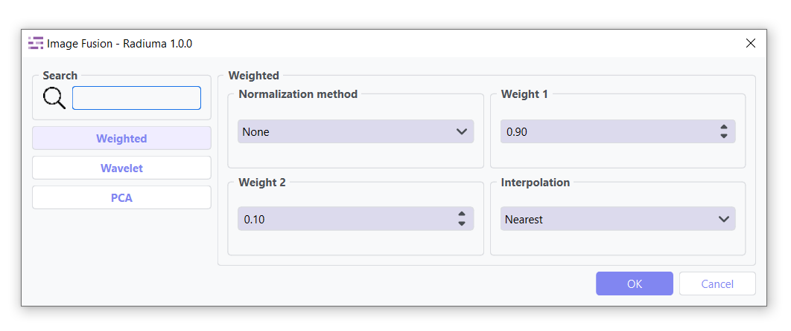
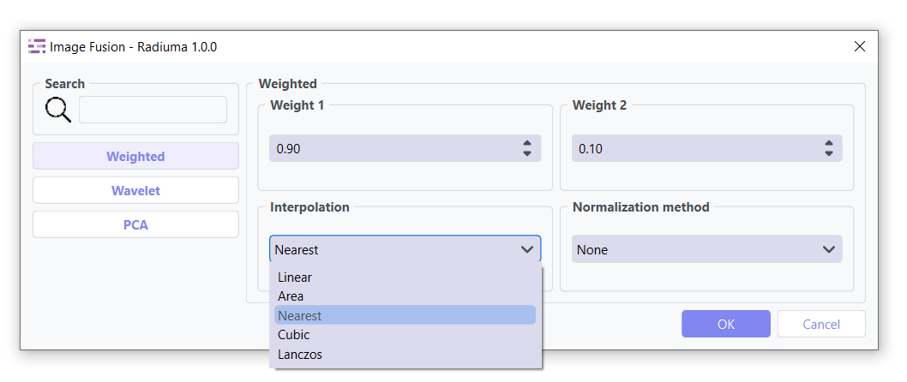

Image Fusion
------------

Advanced capabilities for combining information from multiple imaging modalities.

Weighted Fusion
^^^^^^^^^^^^^^^

.. image:: images/12.image_fusion_Weighted.png
   :alt: Weighted Fusion
   :width: 100%

Combines input images using a linear weighted sum. Ideal for blending anatomical and functional images with controlled emphasis.

**Key Parameters**

* **Weight 1**: Weight for the first input image (range: 0–1)  
* **Weight 2**: Weight for the second input image (range: 0–1)  
* **Interpolation**: Method for interpolating between images (`Linear`, `Area` ,`Nearest` , `Cubic`, `Lanzos`.)(default: `Nearest`) 

Wavelet Fusion
^^^^^^^^^^^^^^

.. image:: images/12.image_fusion_wavelet.png
   :alt: Wavelet Fusion
   :width: 100%

Uses wavelet transform to perform multi-resolution decomposition and fusion of images, preserving fine details.

**Key Parameters**

* **Fusion Method**: Algorithm for combining wavelet coefficients (`Max`, `Min`, `Mean`)  
* **Level**: Number of decomposition levels  
* **Mode**: Signal extrapolation mode (e.g., `symmetric`, `periodic`, etc.)  
* **Wavelet**: Wavelet family to use (e.g., `Haar`, `Db`, etc.)

PCA Fusion
^^^^^^^^^^

.. image:: images/12.image_fusion_pca.png
   :alt: PCA Fusion
   :width: 100%

Applies Principal Component Analysis to extract dominant patterns from multiple images and reconstruct a fused output.

**Key Parameters**

* **Number of Components**: Number of components used for image reconstruction  
* **SVD Solver**: Algorithm used for Singular Value Decomposition  
* **Components**: Number of principal components retained

Workflow Integration
^^^^^^^^^^^^^^^^^^^^

* Takes two input images
* Combines information according to selected method
* Outputs a single fused image
