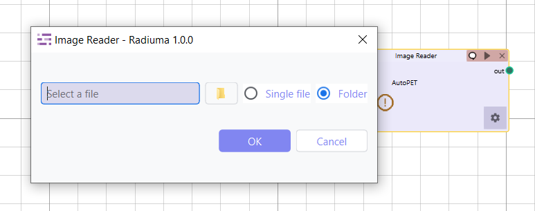
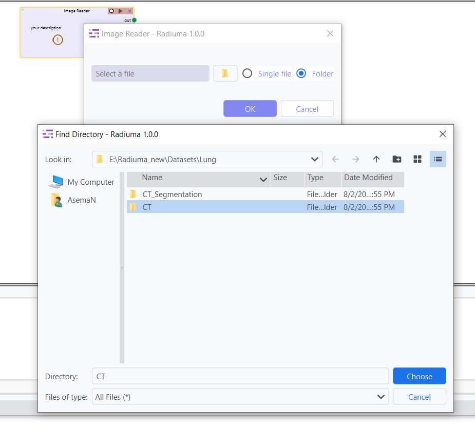
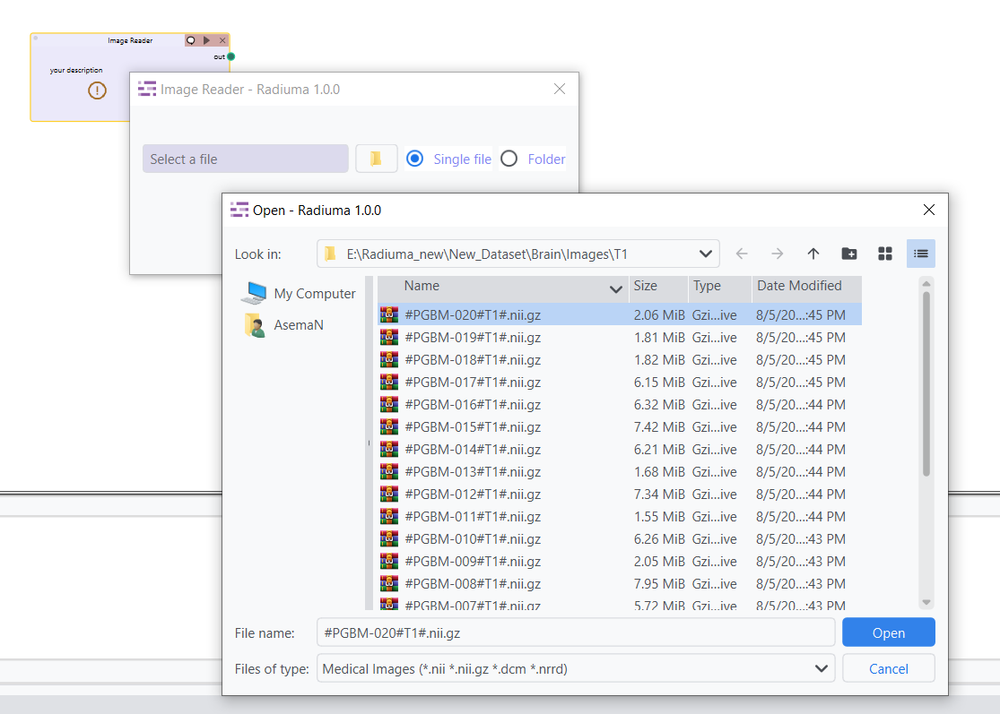
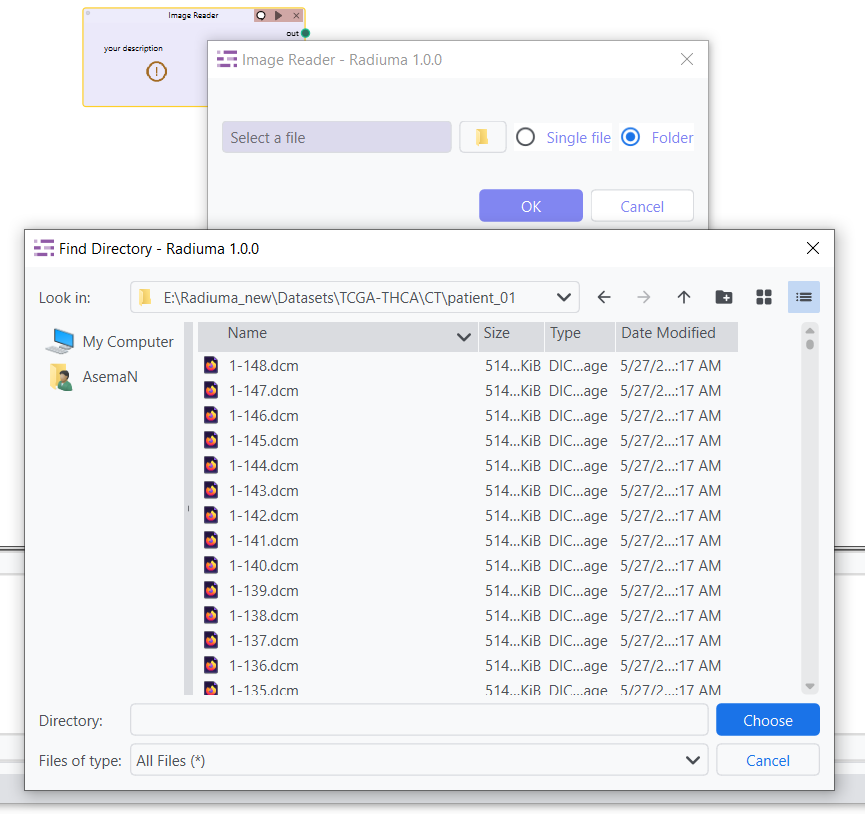

Image Reader
------------

A flexible tool for importing various medical image formats into the Radiuma workflow.

Key Parameters
^^^^^^^^^^^^^^

* **Source Type**: Choose between folder or single file import
* **Path**: Location of the medical image file(s) to import
   

How to Import Data
^^^^^^^^^^^^^^

Radiuma supports importing images from multiple sources and modalities, allowing users to efficiently bring in medical data for further processing. Here's how to import your data, whether you have **DICOM images**, **NIFTI files**, or other formats.

1. **Selecting the Source Type**

You can import your images either from a **folder** containing multiple files or a **single file**:

- **Folder Import**: Choose Folder if your data is organized in directories, such as when images are grouped by patient or modality (e.g., CT, MRI). You will select the main directory, and Radiuma will automatically detect and import all the relevant files from its subfolders.

- **Single File Import**: Choose **Single File** if you're importing one image, like a specific `.nii`, `.dcm`, or `.nrrd` file.

2. **Importing Multi-DICOM Images for Multiple Patients**

Radiuma allows you to import **DICOM files** organized by **patient-specific subfolders**. If you have images for multiple patients with various modalities, you can organize DICOM files into separate subfolders for each patient and modality.

**Example Folder Structure for DICOM images**:

/CT
    /patient_01
        patient_01_ct_001.dcm
        patient_01_ct_002.dcm
    /patient_02
        patient_02_ct_001.dcm
        patient_02_ct_002.dcm

In this case, Radiuma will process the DICOM files inside each patient's subfolder (e.g., `/patient_01/` and `/patient_02/`). If your data is structured like this, **select the main folder** (e.g., `/CT`) and Radiuma will automatically organize and import the files.

**Important Note**:  
Radiuma supports DICOM images inside subfolders. Each patient should have their own folder (e.g., `/patient_01/`) containing their corresponding DICOM files. 

3. **Importing NIFTI (.nii, .nii.gz) Files**

NIFTI files are commonly used in medical imaging. Radiuma supports NIFTI files such as `.nii` and `.nii.gz`. However, for NIFTI imports, the files need to be organized by modality and sequence into subfolders for easy identification.
   
**Correct Folder Structure for NIFTI Files**:

  - `/CT/` for CT images.

  - `/MRI/T1/` for T1-weighted MRI images.

  - `/MRI/T2/` for T2-weighted MRI images.

  - `/MRI/DCE/` for DCE (Dynamic Contrast Enhanced) MRI images.
   
**Example Folder Structure** for NIFTI files:

/CT
  /patient_01
     patient_01_ct_001.nii,
     patient_01_ct_002.nii
/MRI
  /T1
     patient_01_t1_001.nii,
     patient_01_t1_002.nii
  /T2
     patient_01_t2_001.nii,
     patient_01_t2_002.nii
  /DCE
     patient_01_dce_001.nii,
     patient_01_dce_002.nii

**Important Note**: NIFTI files must be organized in specific **modality-based subfolders** like `/MRI/T1/` or `/MRI/T2/`.

4. **Handling Mixed Modalities in a Single Folder**

Radiuma requires that each modality (e.g., CT,PET, MRI) has its own subfolder structure within the main folder.

**Example Directory Structure for Mixed Modalities**:

/data

 /CT
     /patient_01
         patient_01_ct_001.dcm
 /PET
     /patient_01
         patient_01_pet_001.nii
 /MRI
     /T1
         patient_01_t1_001.nii
     /T2
         patient_01_t2_001.nii

* **Note**::

   - Radiuma cannot process CT and PET images together in the same import operation.
   - Modalities must not be mixed in the same folder - keep them in separate subfolders.
   - For multi-modal studies, process each modality separately through the workflow.

Supported Input Formats
^^^^^^^^^^^^^^^^^^^^^^^

Radiuma supports importing a variety of medical image formats, including:

* **DICOM Files and Directories**: Radiuma supports importing individual `.dcm` files or entire directories of DICOM files. Directories should be organized by patient subfolders (e.g., `/CT/patient_01/`).
  
* **NIFTI Files (.nii, .nii.gz and not directories)**: Radiuma can import individual NIFTI files with extensions `.nii` or `.nii.gz`, but it does not support importing NIFTI files from directories. Files must be placed in modality-specific subfolders, such as `/MRI/T1/` for T1 images.

* **NRRD Files (.nrrd)**: Radiuma supports importing `.nrrd` files, which are used for storing medical image data.

* **Various other medical image formats**: Radiuma can also handle other common medical image formats that may not be explicitly listed here.

**Example Directory Structure**:

/data
 /CT
     /patient_01
         patient_01_ct_001.dcm,
         patient_01_ct_002.dcm
     /patient_02
         patient_02_ct_001.dcm,
         patient_02_ct_002.dcm
 /MRI
     /T1
         patient_01_t1_001.nii,
         patient_01_t1_002.nii
     /T2
         patient_01_t2_001.nii,
         patient_01_t2_002.nii

* **Important**::

   - For all formats, proper DICOM metadata or NIFTI header information must be present
   - Uncommon variants or proprietary formats may require conversion before import

Workflow Integration
^^^^^^^^^^^^^^^^^^^^

* Outputs to Image Convertor
* Outputs to Image Filter
* Outputs to Image Fusion
* Outputs to Image Registration
