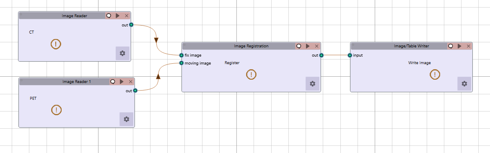

Image Registration
------------------

.. image:: images/10.image_registration.png
   :alt: Image Registration
   :width: 100%

**Image Registration** performs Spatial Alignment and aligns images from different modalities, time points, or viewing angles into a common coordinate system. This essential preprocessing step enables direct comparison and integration of imaging data by correcting for spatial differences, ensuring anatomical consistency across diverse imaging scenarios. Align complementary imaging types (CT, MRI, PET) for fused visualization and analysis. Supports rigid and deformable registration techniques for anatomical consistency across time or modality.

Rigid Registration
^^^^^^^^^^^^^^^^^^
 
.. image:: images/10.image_registration.png
   :alt: Rigid Registration
   :width: 100%

Rigid Registration maintains shape and size by applying only rotation and translation. Suitable for aligning anatomical regions with consistent size and shape.

**Key Parameters**

* **Number of Histogram Bins**: Value for intensity histograms (default: 10)  
* **Sampling Method**: Method for sampling points during registration (`None`, `Random`, `Regular`)

* **Sampling Percentage**: Percentage of voxels to sample (default: 0.01)  
* **Learning Rate**: Step size for optimization (default: 0.01)  
* **Number of Iterations**: Maximum iterations for optimization (default: 5)  
* **Interpolation**: Method for interpolation (`Linear`, `NearestNeighbor`, `BSpline`,  `Gaussian` ,  `LableGaussian`.)

Non-Rigid Registration
^^^^^^^^^^^^^^^^^^^^^^

.. image:: images/10.image_registration_non_rigid.png
   :alt: Non-Rigid Registration
   :width: 100%

Non-Rigid Registration allows local deformations for more precise alignment, especially useful for soft tissue registration in follow-up or multimodal scans.

**Key Parameters**

* **Number of Iterations**: Iterations for deformable registration (default: 5)  
* **Number of Resolutions**: Multi-resolution levels for optimization (default: 1)  
* **Final Grid Spacing**: Density of deformation field (default: 1)  
* **Transform Type**: Type of transformation applied during registration:
   * `BSplineTransform` (default)
   * `EulerTransform`
   * `AffineTransform`

* **Auto-Transform**: Automatic adjustment of transform parameters (`True`/`False`)  
* **Auto-Scale**: Automatic scaling during registration (`True`/`False`)

Simple Non-Rigid Registration
^^^^^^^^^^^^^^^^^^^^^^^^^^^^^

.. image:: images/10.image_registration_simple_non_rigid.png
   :alt: Simple Non-Rigid Registration
   :width: 100%

Simple Non-Rigid Registration is a lightweight version of non-rigid registration optimized for speed and simplicity. Good for applications requiring fast processing with moderate accuracy.

**Key Parameters**

* **Enable Simple Registration**: Toggle simplified non-rigid registration (`True`/`False`)

Workflow Integration
^^^^^^^^^^^^^^^^^^^^

* Takes fixed and moving images as inputs  
* Applies selected registration technique  
* Outputs transformed image aligned to reference

References
^^^^^^^^^^

* **Rigid Registration**: Besl, P.J. and McKay, N.D. (1992). "A Method for Registration of 3-D Shapes." IEEE Transactions on Pattern Analysis and Machine Intelligence, 14(2), 239-256.
* **Non-Rigid Registration**: Rueckert, D., Sonoda, L.I., Hayes, C., Hill, D.L.G., Leach, M.O., and Hawkes, D.J. (1999). "Nonrigid Registration Using Free-Form Deformations: Application to Breast MR Images." IEEE Transactions on Medical Imaging, 18(8), 712-721.
* **Simple Non-Rigid**: Thirion, J.P. (1998). "Image Matching as a Diffusion Process: An Analogy with Maxwell's Demons." Medical Image Analysis, 2(3), 243-260.

