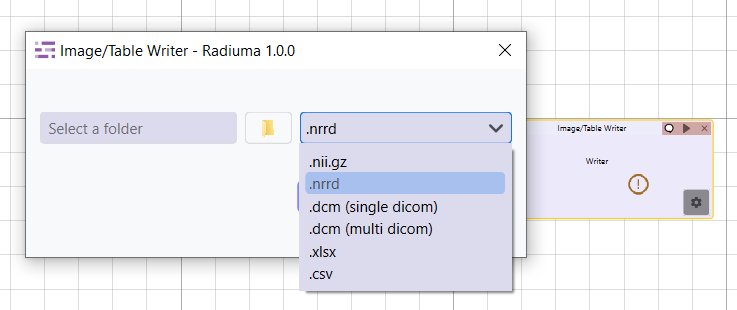

Image/Table Writer
------------------

The **Image/Table Writer** module provides a versatile export interface within Radiuma for saving processed medical images, analysis results, and tabular data in various standardized formats. This essential output tool enables researchers and clinicians to efficiently export their processed data for further analysis, reporting, or integration with other systems, supporting multiple file formats including Excel spreadsheets for comprehensive tabular data, CSV files for lightweight data exchange, DICOM files for clinical compatibility, NIFTI files for neuroimaging applications, and NRRD files for specialized medical image processing. Through an intuitive interface with configurable export parameters, users can seamlessly save single files or batch exports, ensuring data preservation and interoperability across different platforms and analysis workflows in both clinical and research environments.

Writer Parameters
^^^^^^^^^^^^^^^^^

* **File or Folder Path**: Location of the input data file or folder
* **Format**: Choice of output format (.xlsx, .csv, single/multiple .dcm, .nii.gz, .nrrd)

Writer Parameters
^^^^^^^^^^^^^^^^^

* **Path**: Destination for saving the output data
* **File Format**: Choice of output format (.xlsx, .csv, .dcm, .nii.gz, .nrrd)
* **Single/Multi File**: Option to save as single file or multiple files

Supported Formats
^^^^^^^^^^^^^^^^^

* CSV files
* Excel spreadsheets
* Structured data exports from analysis tools
* DICOM files
* NIFTI files
* NRRD files
