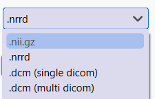
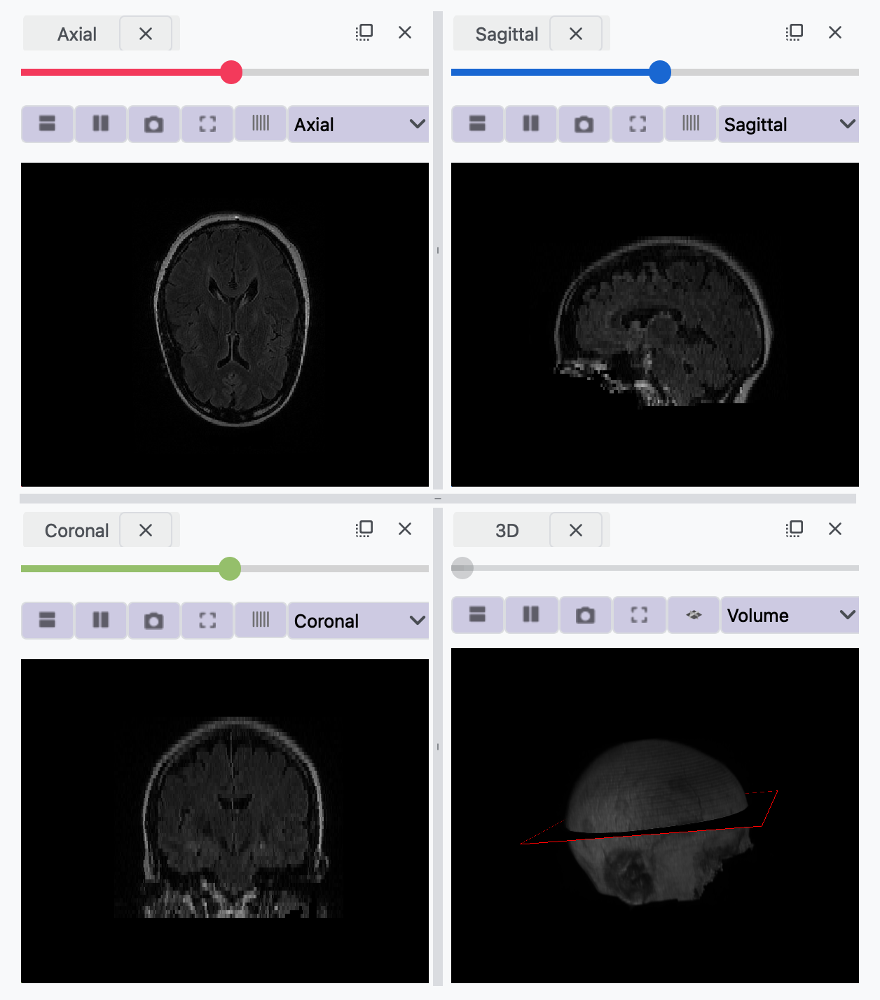
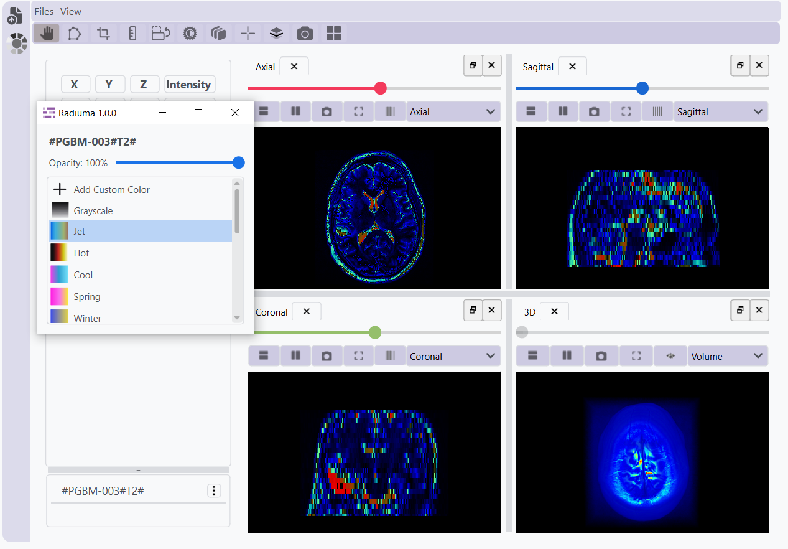
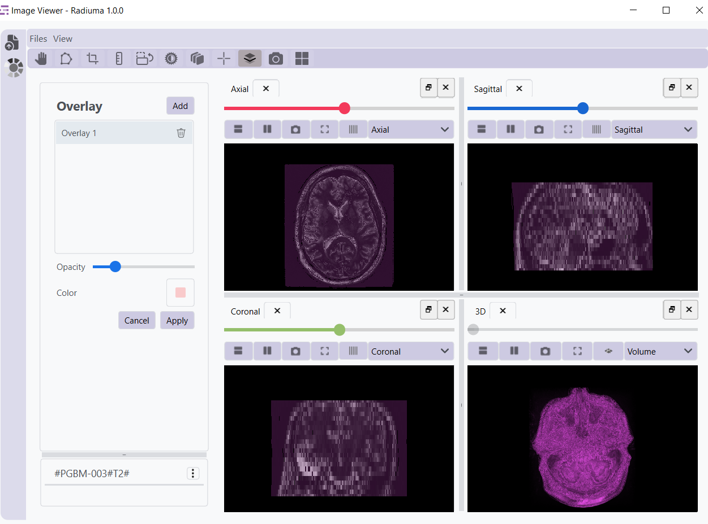
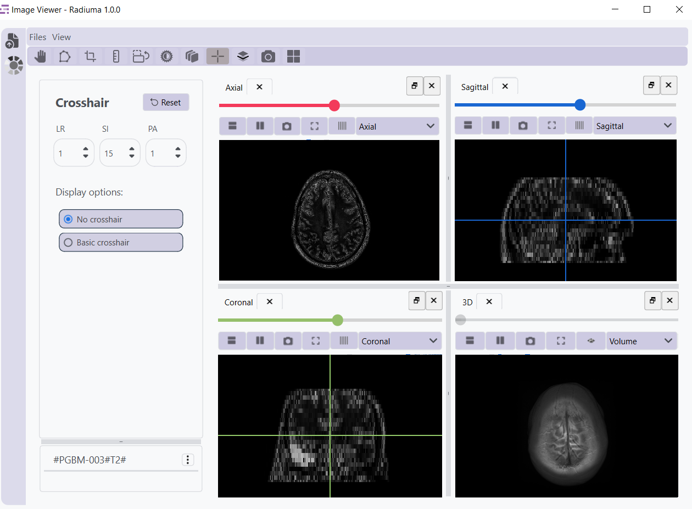
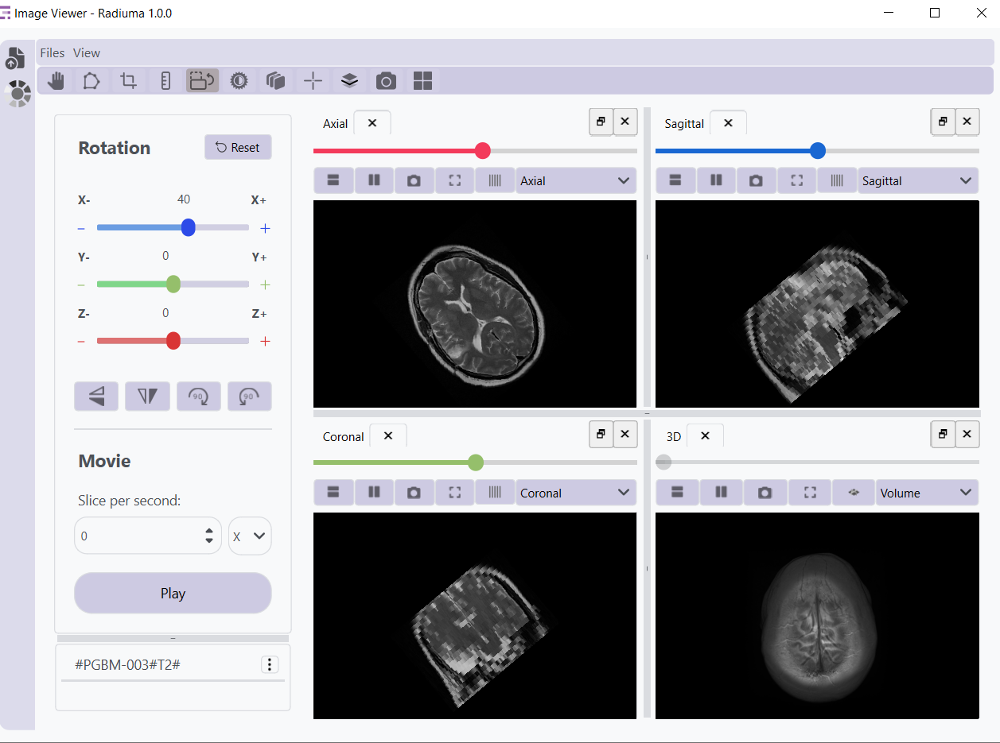
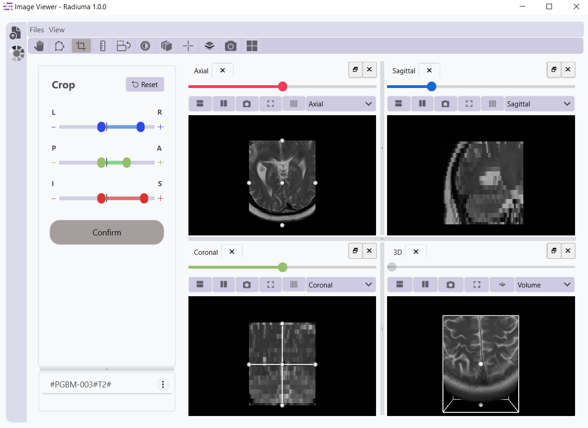
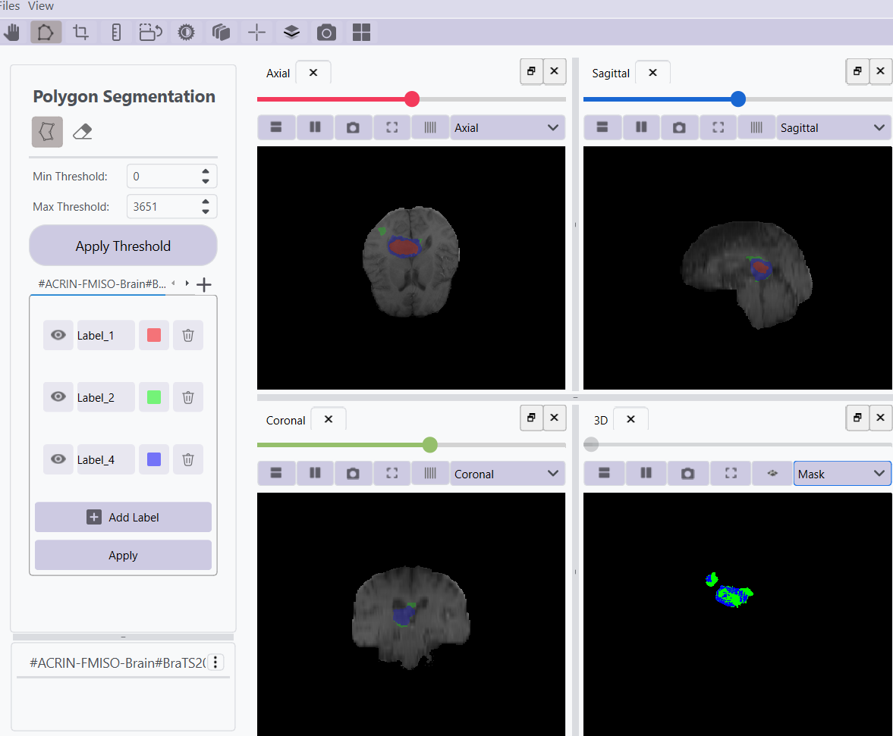

Image Viewer
------------

The Medical Image Viewer is a comprehensive tool designed for advanced medical image visualization and analysis, providing tools for detailed examination, segmentation, and analysis of medical imaging data.

View Types
^^^^^^^^^^

* **Axial View**: Horizontal cross-sections (top-down view)
* **Sagittal View**: Vertical cross-sections from side to side
* **Coronal View**: Vertical cross-sections from front to back
* **3D View**: Complete three-dimensional rendering with:

  * Volume View: Full 3D visualization of image data
  * Mask View: Visualization of segmentation results

File Support
^^^^^^^^^^^^

* NIFTI Files: Support for Neuroimaging Informatics Technology Initiative format (Nifti)
* DICOM Files: Individual Digital Imaging and Communications in Medicine (DICOM) image support
* DICOM Directories: Support for complete DICOM studies/series
* Segmentation Files: Import/export of segmentation data
* RT Structure Files: Import RT structure files

Toolbar Functions
^^^^^^^^^^^^^^^^^

**Image Navigation & Information**

* **Hand Tool**: Real-time coordinate display, intensity values, metadata access
* **Image List**: Layer navigation with options for information, removal, and colormap customization

**Image Manipulation Tools**

* **Segmentation**: Threshold-based and manual drawing tools
* **Crop Tool**: Define regions of interest
* **Ruler**: Precise distance measurements
* **Rotation**: Rotate images along any axis with animation capabilities
* **Contrast**: Window/level adjustment and brightness controls
* **Filter**: Apply threshold-based filters

**Visualization Controls**

* **Crosshairs**: Toggle visibility, synchronized across all views
* **Overlay**: Add image layers with transparency control
* **Screenshot**: Capture and save current view
* **Layout Control**: Reset to standard four-panel layout

Detailed Functionality
^^^^^^^^^^^^^^^^^^^^^

Pan Tool
""""""""

The Pan tool is a button in the 3D view that shows a plane of the current slice in 2D view. Clicking on each 2D view changes the focus to that view and displays the corresponding slice. Users can navigate through slices in each 2D view by dragging the slider located at the top of the view. This functionality is essential for examining specific areas of interest in large medical images.

Image Information
""""""""""""""""

Access detailed information about the active image, including dimensions, spacing, origin coordinates, and voxel intensity statistics. This feature provides essential metadata for accurate image analysis. You can access the image information by clicking the 3 dots at the left side of the loaded image and selecting "Image Information".

Colormap Adjustment
""""""""""""""""""

Customize the visualization of medical images by selecting from a variety of color schemes. Different colormaps can highlight specific tissue types or abnormalities, enhancing visual interpretation of complex medical data. Access the colormap panel by clicking the 3 dots beside the loaded image and selecting the colormap option.

Image Overlay
""""""""""""

Combine multiple images using overlay techniques with adjustable transparency levels. This functionality is valuable for comparing different imaging modalities or pre/post-treatment images.

Breeding
""""""""""""

Add another view to the current view either horizontally or vertically. This feature allows for efficient side-by-side or stacked comparison of different image perspectives.

Crosshair Navigation
"""""""""""""""""""

Enable synchronized crosshairs across all views for precise anatomical localization. Crosshairs help in identifying the same point across different orthogonal views (axial, sagittal, coronal).

Image Filtering
""""""""""""""

Apply image filter to enhance visualization or highlight specific features. Filters can be used to enhance edges, or apply thresholds based on intensity values.

Contrast Adjustment
""""""""""""""""""

Fine-tune window/level settings to optimize image contrast for specific tissues or pathologies. This essential tool allows users to visualize structures with different density or intensity characteristics.

Image Rotation
"""""""""""""

Rotate medical images along any axis with precise angle control. Rotation capabilities help in standardizing image orientation or examining structures from different perspectives.

Distance Measurement
"""""""""""""""""""

Measure precise distances between anatomical structures using the ruler tool. This functionality provides quantitative spatial information critical for diagnosis and treatment planning.

Image Cropping
"""""""""""""

Define and extract regions of interest (ROI) to focus analysis on specific areas. Cropping helps reduce computational load and increase precision by limiting operations to relevant image portions.

Segmentation Tools
"""""""""""""""""

.. image:: images/5.image_viewer_segmentation.png
   :alt: Segmentation Tools
   :width: 100%    

Create anatomical or pathological segmentations using manual and semi-automated tools. The segmentation interface provides brush and drawing options for precise delineation of structures.

Volume Mask Toggle
""""""""""""""""""""""""""""""

Toggle in the 3D view that switches between volume mode and mask mode. Volume mode displays both the image and segmentations together, while mask mode shows only the segmentations, allowing for clearer visualization of the segmented structures.
