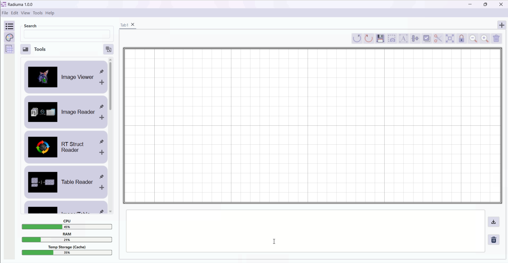

Welcome to Radiuma Documentation
=================================

   
Radiuma - Visualized & Standardized Environment for Radiomics Analysis is a powerful workflow generator for standardized radiomics analysis and medical image visualization. It provides a free, open-source platform specialized for visualization, processing, segmentation, registration, fusion, and analysis of medical/biomedical images, including radiomics and machine learning capabilities.

.. toctree::
   :maxdepth: 3
   :caption: Contents:

   overview
   key_features
   visual_node_system
   workflow_tools
   examples
