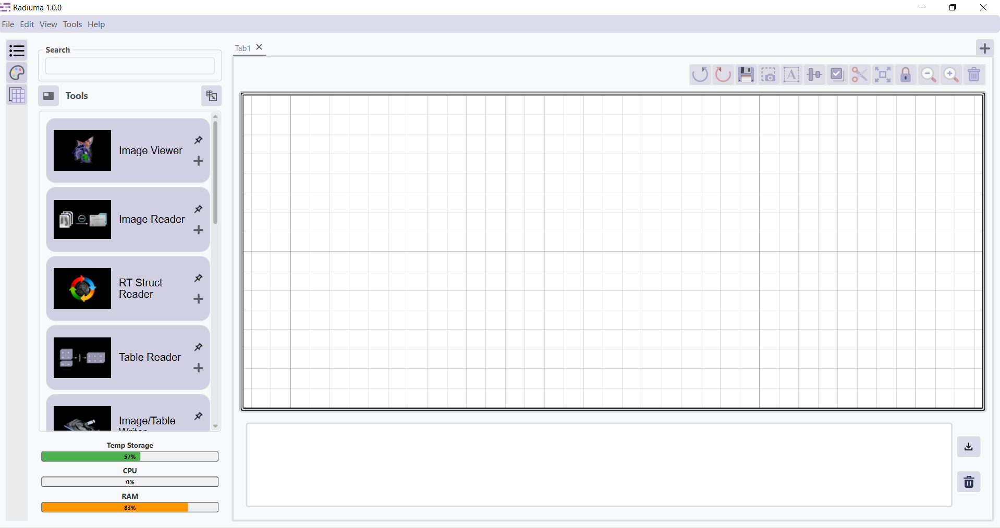

Overview
========

   
Radiuma is a comprehensive toolkit for advanced medical image analysis and machine learning. It integrates a broad set of processing tools and algorithms into standardized, end-to-end workflows, enabling reproducible research and seamless integration across diverse components within a unified framework.
