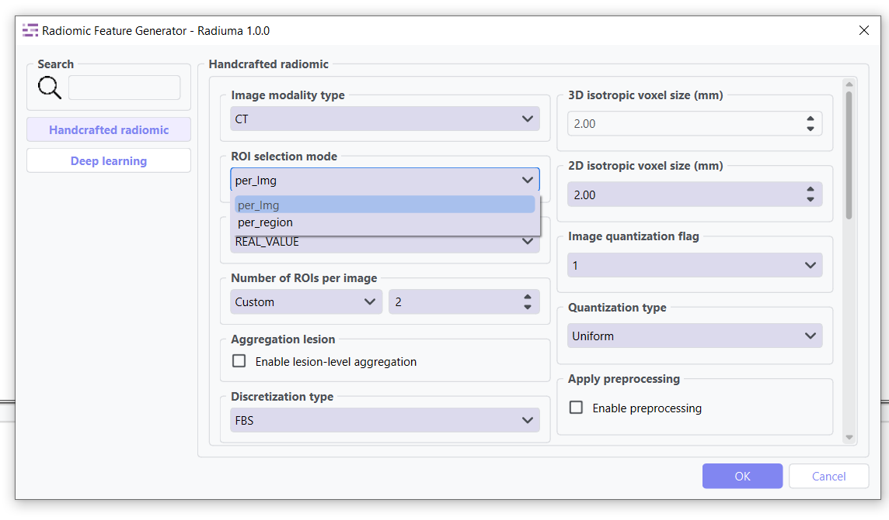
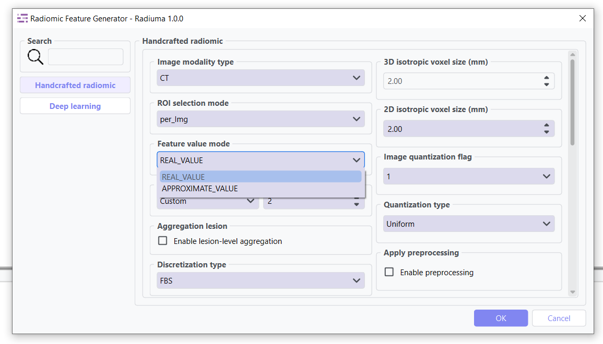

Radiomic Feature Generator
------------------------

.. image:: images/13.radiomic.png
   :alt: Radiomic Feature Generator
   :width: 100%

Core tool for extracting standardized quantitative features from medical images following IBSI guidelines. 

.. image:: images/13.radiomic_deep.png
   :alt: Radiomic Feature Generator Deep
   :width: 100%
   
This tool also has a deep learning mode that can be used to extract features from images.

Feature Types
^^^^^^^^^^^^^
    
* **First-order Statistics**: Intensity-based features
* **Shape-based Features**: Morphological characteristics
* **Texture Features**: Spatial patterns (GLCM, GLRLM, etc.)
* **Wavelet Features**: Multi-resolution analysis

Key Parameters
^^^^^^^^^^^^^^

**Data Type: Modality type (MR, CT, PET, OTHER)**

 Select the imaging modality for which radiomic features will be calculated.  

- **MR**: Magnetic Resonance images  
- **CT**: Computed Tomography images  
- **PET**: Positron Emission Tomography images  
- **OTHER**: For modalities such as Ultrasound or X-ray  
This parameter ensures that modality-specific preprocessing and intensity interpretation are applied correctly before feature extraction.

**ROI Selection Mode: ROI selection strategy**

 Determines how regions of interest (ROIs) are selected for feature extraction.

- **"per_Img"** (default): Selects the top roi_num ROIs per image based on size, regardless of label category.

  - Suitable for single or dominant lesions per scan.
  - Preserves original spatial relationships.

- **"per_region"**: Selects up to roi_num ROIs separately for each label category, ensuring balanced representation across regions.

  - Useful in multi-lesion, multi-label, or longitudinal studies.
  - Requires consistent ROI labeling across datasets.

**Feature Value Mode: Strategy for handling NaN values**

 Controls how missing or invalid feature values are handled during extraction.

- **"REAL_VALUE"** (default): Keeps NaN values whenever feature extraction fails (e.g., small ROI, numerical instability), preserving the raw outcome without substitution.

- **"APPROXIMATE_VALUE"**: Replaces NaN features with substitutes (e.g., very small constants like 1e-30 or synthetic masks) to maintain pipeline continuity.

.. image:: images/13.radiomic_discretization.png
   :alt: Radiomic Feature Generator
   :width: 100%

* **Discretization Type**: Method for binning intensity values (FBS, FBN)

* **Bin Size**: Size of intensity bins for feature calculation
* **Resampling Flag**: Whether to perform scaling (0: disabled, 1: enabled)

.. image:: images/13.radiomic_interpolation.png
   :alt: Radiomic Feature Generator
   :width: 100%

* **Image Interpolation**: Method for resampling images (Nearest, Linear, Cubic)

* **ROI Interpolation**: Method for resampling masks (Nearest, Linear, Cubic)
* **3D Isotropic Voxel Size**: Size for resampling to isotropic voxels
* **2D Isotropic Voxel Size**: Size for 2D isotropic voxels
* **Isotropic 2D Voxels Flag**: Whether to resample to 2D isotropic voxels
* **Intensity Rounding**: Option to round intensity values (0: disabled, 1: enabled)
* **Segmentation Range**: Option to limit intensity range (0: disabled, 1: enabled)
* **Resegmentation Interval**: Min and max values for intensity range
* **Outlier Filtering**: Methods for handling outliers (0: disabled, 1: enabled)
* **Quantization Method**: Approach for discretizing intensities (Uniform, Lloyd)
* **Intensity Volume Histogram Type**: Setting for IVH unit type

.. image:: images/13.radiomic_ivh.png
   :alt: Radiomic Feature Generator
   :width: 100%

* **IVH Discretization Type**: Discrete or Continuous (0,1, 2, 3)
* **IVH Bin Size**: Bin size for IVH discretization
* **Maximum ROIs**: Number of regions to analyze per image (Maximum or specific number)
* **ROIs per Image**: Number of ROIs to process when not set to Maximum
* **Combine ROIs**: Whether to combine ROIs for analysis (0: disabled, 1: enabled)
* **Features to Output**: Which feature set to calculate (options from 487 total features)

Workflow Integration
^^^^^^^^^^^^^^^^^^^^

* Takes both image and mask inputs
* Extracts features according to standardized definitions
* Outputs tabular data with all calculated features
