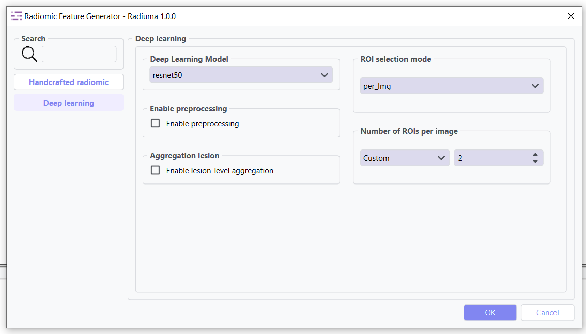

Radiomic Feature Generator
------------------------

.. image:: images/13.radiomic.png
   :alt: Radiomic Feature Generator
   :width: 100%

Core tool for extracting standardized quantitative features from medical images following IBSI guidelines. 

   
This tool also has a deep learning mode that can be used to extract features from images.

Feature Types
^^^^^^^^^^^^^
    
* **First-order Statistics**: Intensity-based features
* **Shape-based Features**: Morphological characteristics
* **Texture Features**: Spatial patterns (GLCM, GLRLM, etc.)
* **Wavelet Features**: Multi-resolution analysis

Key Parameters
^^^^^^^^^^^^^^

* **Data Type**: Modality type (MR, CT, PET, OTHER)
* **Discretization Type**: Method for binning intensity values (FBS, FBN)
* **Bin Size**: Size of intensity bins for feature calculation
* **Resampling Flag**: Whether to perform scaling (0: disabled, 1: enabled)
* **Image Interpolation**: Method for resampling images (Nearest, Linear, Cubic)
* **ROI Interpolation**: Method for resampling masks (Nearest, Linear, Cubic)
* **3D Isotropic Voxel Size**: Size for resampling to isotropic voxels
* **2D Isotropic Voxel Size**: Size for 2D isotropic voxels
* **Isotropic 2D Voxels Flag**: Whether to resample to 2D isotropic voxels
* **Intensity Rounding**: Option to round intensity values (0: disabled, 1: enabled)
* **Segmentation Range**: Option to limit intensity range (0: disabled, 1: enabled)
* **Resegmentation Interval**: Min and max values for intensity range
* **Outlier Filtering**: Methods for handling outliers (0: disabled, 1: enabled)
* **Quantization Method**: Approach for discretizing intensities (Uniform, Lloyd)
* **Intensity Volume Histogram Type**: Setting for IVH unit type
* **IVH Discretization Type**: Discrete or Continuous (1, 2, 3)
* **IVH Bin Size**: Bin size for IVH discretization
* **Maximum ROIs**: Number of regions to analyze per image (Maximum or specific number)
* **ROIs per Image**: Number of ROIs to process when not set to Maximum
* **Combine ROIs**: Whether to combine ROIs for analysis (0: disabled, 1: enabled)
* **Features to Output**: Which feature set to calculate (options from 487 total features)

Workflow Integration
^^^^^^^^^^^^^^^^^^^^

* Takes both image and mask inputs
* Extracts features according to standardized definitions
* Outputs tabular data with all calculated features
