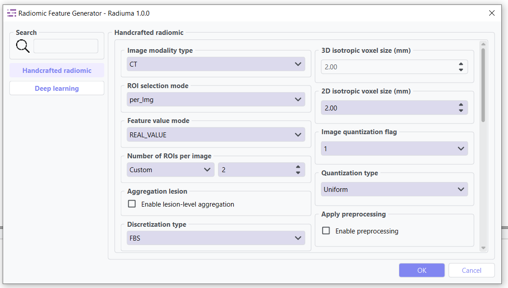
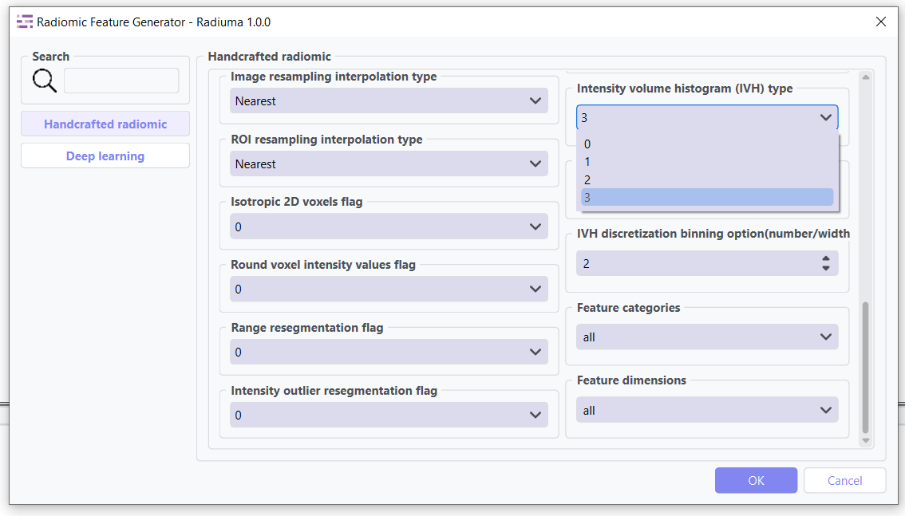
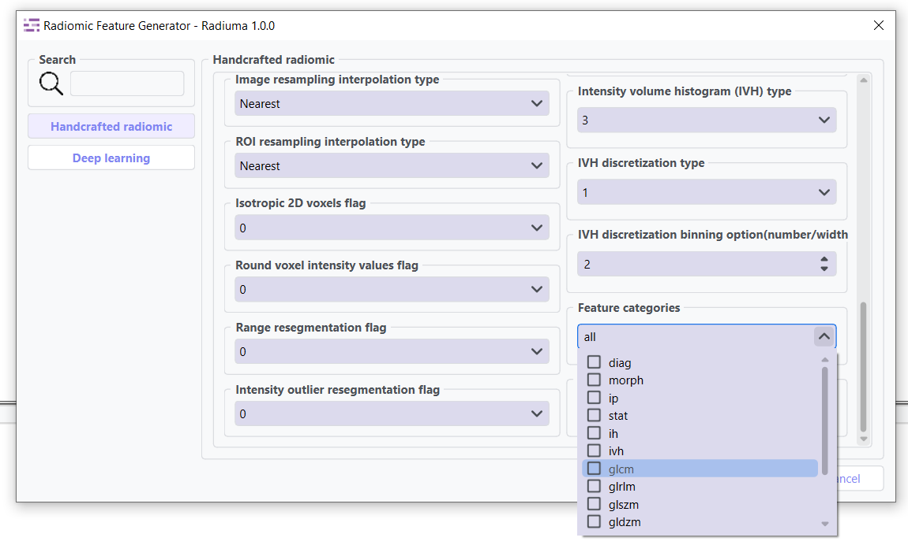

Radiomic Feature Generator
------------------------

The **Radiomic Feature Generator** module provides an advanced interface within Radiuma for extracting standardized quantitative features from medical images, powered by the **PySERA** (Python-Based Standardized Extraction for Radiomics Analysis) engine an Open-source library that ensures full **IBSI 1** (Image Biomarker Standardisation Initiative) compliance. This sophisticated tool enables researchers and clinicians to extract both traditional handcrafted radiomic features and deep learning-based features through a unified workflow, supporting **557** total features including 487 IBSI-compliant features, 60 diagnostic metrics, and 10 moment-invariant descriptors across multiple spatial dimensions (1st order, 2D, 2.5D, 3D). Combined with the IBSI 2-compliant filtering capabilities in the Image Filter module, Radiuma provides a comprehensive standardized pipeline for medical image analysis from preprocessing to feature extraction. With configurable parameters for modality-specific preprocessing, ROI selection strategies, feature aggregation, and advanced extraction modes, the module delivers comprehensive quantitative imaging biomarkers for disease characterization, treatment response assessment, and predictive modeling—all while maintaining standardization, reproducibility, and clinical interpretability through its integrated PySERA computational backend.

* **PySERA Repository**: https://github.com/MohammadRSalmanpour/PySERA
* **Compliance**: Full IBSI 1 standardization across radiomics and filtering modules

.. image:: images/13.radiomic_deep.png
   :alt: Radiomic Feature Generator Deep
   :width: 100%
   
This tool can extract deep features using pre-trained CNNs: **ResNet50**, **VGG16**, and **DenseNet121**.
Deep learning features are output as high-dimensional vectors with: 

- Model-specific feature dimensions (511-2047 features)
- Feature names derived from the network architecture
- Compatible format with traditional radiomic feature tables
- Ready for machine learning and statistical analysis

**Deep Learning Features:**

-  ResNet50 deep features : **2047 feats: ['resnet50']**
-  VGG16 deep features  : **511 feats: ['vgg16']**
-  DenseNet121 deep features : **1023 feats: ['densenet121']**

Feature Types
^^^^^^^^^^^^^
    
* **First-order Statistics**: Intensity-based features
* **Shape-based Features**: Morphological characteristics
* **Texture Features**: Spatial patterns (GLCM, GLRLM, etc.)
* **Wavelet Features**: Multi-resolution analysis
* **Deep Features**: CNN-based embeddings from ResNet50, VGG16, or DenseNet121

Key Parameters
^^^^^^^^^^^^^^

.. image:: images/13.radiomic_data.png
   :alt: Radiomic Feature Generator
   :width: 100%

**Data Type: Modality type (MR, CT, PET, OTHER)**

 Select the imaging modality for which radiomic features will be calculated.  

- **MR**: Magnetic Resonance images  
- **CT**: Computed Tomography images  
- **PET**: Positron Emission Tomography images  
- **OTHER**: For modalities such as Ultrasound or X-ray  
This parameter ensures that modality-specific preprocessing and intensity interpretation are applied correctly before feature extraction.

.. image:: images/13.radiomic_roi_selection.png
   :alt: Radiomic Feature Generator 
   :width: 100%

**ROI Selection Mode: ROI selection strategy**

 Determines how regions of interest (ROIs) are selected for feature extraction.

- **"per_Img"** (default): Selects the top roi_num ROIs per image based on size, regardless of label category.

  - Suitable for single or dominant lesions per scan.
  - Preserves original spatial relationships.

- **"per_region"**: Selects up to roi_num ROIs separately for each label category, ensuring balanced representation across regions.

  - Useful in multi-lesion, multi-label, or longitudinal studies.
  - Requires consistent ROI labeling across datasets.

.. image:: images/13.radiomic_featurevalue_mode.png
   :alt: Radiomic Feature Generator
   :width: 100%

**Feature Value Mode: Strategy for handling NaN values**

 Controls how missing or invalid feature values are handled during extraction.

- **"REAL_VALUE"** (default): Keeps NaN values whenever feature extraction fails (e.g., small ROI, numerical instability), preserving the raw outcome without substitution.

- **"APPROXIMATE_VALUE"**: Replaces NaN features with substitutes (e.g., very small constants like 1e-30 or synthetic masks) to maintain pipeline continuity.

* **ROIs per Image/Region**: Number of ROIs to process when not set to Maximum

  Controls the maximum number of regions of interest to analyze per image when not using the "Maximum" option.(Default: 2 ROIs)

**Aggregation Lesion: Multi-ROI feature aggregation**

When enabled, this parameter performs lesion-level feature aggregation across ROIs belonging to the same image or anatomical region, depending on the roi_selection_mode setting.

- **False** (default): Features extracted for each ROI individually

- **True**: Features aggregated across related ROIs using specialized methods

**Grouping Strategy:**

- When **roi_selection_mode="per_Img"**: Aggregation performed by PatientID
- When **roi_selection_mode="per_region"**: Grouping based on both PatientID and label ID

**Feature Aggregation Methods:**

Feature aggregation is conducted on a per-feature basis using specialized approaches:

- **Deep Features** (`extraction_mode="deep_feature"`): All features are averaged across ROIs
- **Morphological Descriptors**: Weighted average based on `morph_volume_mesh` for:

  - `morph_volume_mesh`
  - `morph_volume_count` 
  - `morph_surface_area`
  - `morph_max_3d_diameter`
  - `morph_major_axis_length`
  - `morph_minor_axis_length`
  - `morph_least_axis_length`

- **Diagnostic Features**: Selected from the largest lesion (based on volume)
- **All Remaining Features**: Summed across ROIs
- **Missing Values**: Excluded from the aggregation process

**Use Cases:**

- Multi-focal disease analysis
- Longitudinal studies with multiple time points
- Whole-organ or multi-region characterization
- Comparative analysis across lesion populations

* **Discretization Type**: Method for binning intensity values (FBS, FBN)

* **Bin Size**: Size of intensity bins for feature calculation
* **Resampling Flag**: Whether to perform scaling (0: disabled, 1: enabled)

.. image:: images/13.radiomic_interpolation.png
   :alt: Radiomic Feature Generator
   :width: 100%

* **Image Interpolation**: Method for resampling images (Nearest, Linear, Cubic)

* **ROI Interpolation**: Method for resampling masks (Nearest, Linear, Cubic)
* **3D Isotropic Voxel Size**: Size for resampling to isotropic voxels
* **2D Isotropic Voxel Size**: Size for 2D isotropic voxels
* **Isotropic 2D Voxels Flag**: Whether to resample to 2D isotropic voxels
* **Intensity Rounding**: Option to round intensity values (0: disabled, 1: enabled)
* **Segmentation Range**: Option to limit intensity range (0: disabled, 1: enabled)
* **Resegmentation Interval**: Min and max values for intensity range
* **Outlier Filtering**: Methods for handling outliers (0: disabled, 1: enabled)
* **Quantization Method**: Approach for discretizing intensities (Uniform, Lloyd)
* **Intensity Volume Histogram Type**: Setting for IVH unit type

* **IVH Discretization Type**: Discrete or Continuous (0,1, 2, 3)
* **IVH Bin Size**: Bin size for IVH discretization
* **Maximum ROIs**: Number of regions to analyze per image (Maximum or specific number)
* **Features to Output**: Which feature set to calculate (options from 487 total features)

Available Feature Sets
^^^^^^^^^^^^^^^^^^^^^^

**Feature Categories: Types of radiomic features to extract**

 Comprehensive selection of feature categories following IBSI standards.

- **"diag"**: Diagnostic features - basic ROI statistics and quality metrics
- **"morph"**: Morphological/shape features - 3D shape descriptors of ROIs
- **"ip"**: Intensity peak features - peak intensity characteristics
- **"stat"**: First-order statistical features - intensity distribution statistics
- **"ih"**: Intensity histogram features - histogram-based intensity analysis
- **"ivh"**: Intensity-volume histogram features - volume-intensity relationships
- **"glcm"**: Gray-Level Co-occurrence Matrix - texture patterns from co-occurrence
- **"glrlm"**: Gray-Level Run Length Matrix - texture patterns from run lengths
- **"glszm"**: Gray-Level Size Zone Matrix - texture patterns from zone sizes
- **"gldzm"**: Gray-Level Distance Zone Matrix - texture patterns from zone distances
- **"ngtdm"**: Neighboring Gray-Tone Difference Matrix - local intensity differences
- **"ngldm"**: Neighboring Gray-Level Dependence Matrix - intensity dependencies
- **"mi"**: Moment-invariant features - rotation and scale invariant moments

**Dimensions: Spatial dimensions for feature extraction**

 Defines the spatial context for feature calculation.

- **"1st"**: First-order intensity-based features (non-spatial)
- **"2D"**: Features extracted per 2D slice (slice-wise analysis)
- **"2_5D"**: Features aggregated across slices with limited inter-slice context
- **"3D"**: Fully volumetric features across entire ROI (3D spatial analysis)

Workflow Integration
^^^^^^^^^^^^^^^^^^^^

.. image:: images/13.radiomic_workflow.png
   :alt: Radiomic Feature Generator
   :width: 100%

* Takes both image and mask inputs
* Extracts features according to standardized definitions

- **Example Workflow**: `Download the Radiomic Feature Extraction workflow <https://github.com/MohammadRSalmanpour/RADIUMA-DOUCUMENTATION/blob/main/Examples/Workflows/Radiomic_Feature.radiuma>`_

Feature Output Example
^^^^^^^^^^^^^^^^^^^^^^^^

Outputs tabular data with all calculated features

