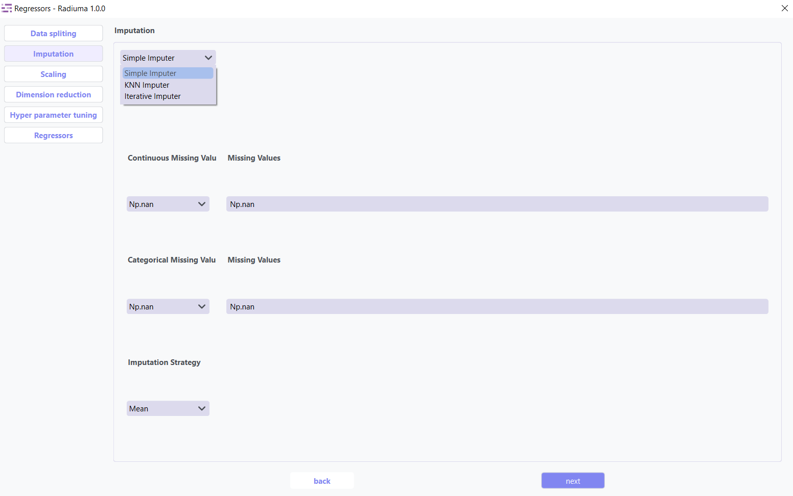
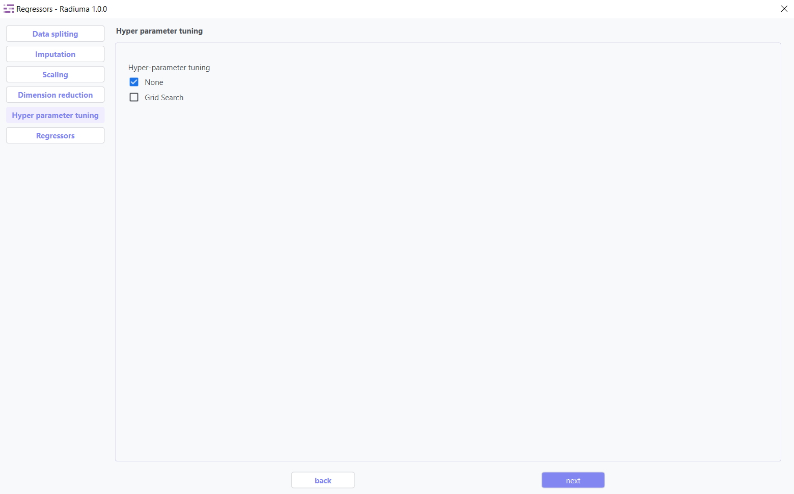
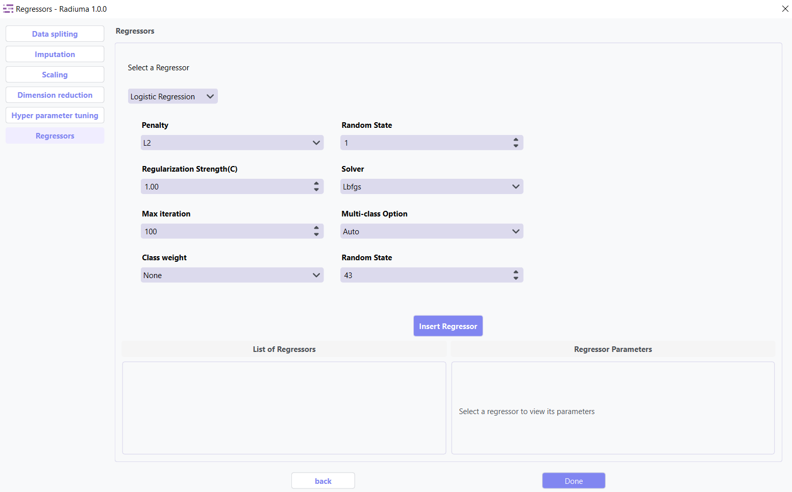

Regression
---------

Overview
^^^^^^^^

The Regression module delivers a streamlined, step-by-step workflow within the RADIUMA application for building predictive models with continuous target variables. Starting with structured data import, the interface automatically validates your feature and target tables to ensure proper formatting before analysis. Through an organized sequence of configurable panels, you can systematically apply data splitting strategies, address missing values using sophisticated imputation techniques, normalize features with multiple scaling options, and optimize your dataset through dimension reduction methods. The module then presents a comprehensive selection of regression algorithms with customizable parameters, enabling simultaneous training and comparison of multiple models. The system culminates with detailed performance metrics and residual analysis, providing you with the tools to identify the most accurate predictive model for your clinical research, outcome prediction, or biomarker discovery projects—all within a unified, user-friendly environment designed for both statistical experts and medical researchers.

The Regression tool provides a complete predictive modeling pipeline for continuous target variables with:

* 6+ regression algorithms
* Automated data preprocessing
* Hyperparameter optimization
* Comprehensive model evaluation

Data Import
^^^^^^^^^^^

Before splitting or processing your data, ensure it is **properly structured**.

.. note::
   Both **feature** and **target** tables must follow these requirements:

   1. **Identical Sample IDs** in the first column of both tables.
   2. Sample IDs must **match exactly**.  
      e.g., `Patient_001` in the feature table = `Patient_001` in the target table.
   3. Target column must be **categorical** for classification tasks (e.g., `High` / `Low` or `0` / `1`).

**Data Import Steps:**

1. **Import Feature Table**

   .. image:: images/15.regression_input_data.png
      :alt: Import Feature Table
      :width: 80%

   Select your main data table containing all **features/predictors**.  
   Preview the table to verify structure.

2. **Import Target Table**

   .. image:: images/15.regression_target.png
      :alt: Import Target Table
      :width: 80%

   Select your target table containing only **Sample IDs** and **Class Labels**.  
   Preview the table to verify structure.

Data Splitting
^^^^^^^^^^^^^^

**Important Note :** 

* **Data Requirement**: The first column of both the input data and the target data must contain identical sample IDs.

**Data Splitting Options:**

* **Shuffle**: Enable shuffling to randomize the data before splitting
* **Split**: Choose between percentage split or K-fold cross-validation
* **Percentage**: Specify training data percentage (e.g., 80%)
* **K-fold**: Set the number of folds for cross-validation
* **Perform Final Test**: Option to reserve data for final testing

Imputation
^^^^^^^^^^

The imputation step addresses missing values in your dataset by replacing them with calculated values using three advanced strategies: **Simple Imputer, KNN Imputer, and Iterative Imputer**. Options include mean, median, or mode imputation for categorical data, ensuring your classification models have complete datasets for accurate predictions.

1. **Simple Imputer:** Basic replacement strategies for quick handling of missing data.

**Imputation Options:**

* **Continuous Missing Value**: Strategy for handling missing numerical values
* **Categorical Missing Value**: Strategy for handling missing categorical values

**Imputation Strategy:**

* **Mean**: Replace with feature mean
* **Median**: Replace with feature median
* **Most Frequent**: Replace with most common value
* **Constant**: Replace with user-specified value

2. **KNN Imputer:** Nearest-neighbor based imputation using feature similarity.

* **Key Parameters**:
   
* **n_neighbors** (default: 5) – Number of neighbors used to impute missing values
* **metric** – Distance function non-euclidean, 
* **weights** – uniform or distance (distance gives more weight to closer neighbors)

3. **Iterative Imputer:** Advanced method that models each feature with missing values as a function of other features.

* **Key Parameters**:

* **Estimator**  
  Algorithm used to predict missing values for each feature.  

  Common options include:

  - **BayesianRidge** *(default)* – Performs regularized linear regression using Bayesian principles  
  - **GaussianProcessRegressor** – Models non-linear relationships with probabilistic output  
  - **KernelRidge** – Combines ridge regression with kernel tricks for non-linear features  
  - **KNeighborsRegressor** – Uses neighboring samples to estimate missing values  
  - **LinearRegression** – Basic linear approach for imputation  
  - **Lasso / Ridge / ElasticNet** – Regularized linear models for better generalization

* **Imputation Order**  
  Determines the sequence in which features are imputed:

  - **Ascending** *(default)* – Start from features with fewest missing values  
  - **Descending** – Start from features with most missing values  
  - **Random** – Random order for each iteration  
  - **Roman** – Left-to-right (fixed order)

Scaling
^^^^^^^

.. image:: images/14._scaling.png
   :alt: Regression Scaling
   :width: 100%

Feature scaling transforms your features to a common scale, which is essential for many classification algorithms that are sensitive to feature magnitudes. Methods like StandardScaler, MinMaxScaler,Max abs Scaler,Normalizer and RobustScaler help improve model convergence and performance.

Dimention Reduction
^^^^^^^^^^^^^^^^^

Dimension reduction techniques optimize your dataset by identifying and retaining only the most valuable features. These methods serve two primary purposes:

1. **Attribute Extraction**: Transforms features into a more compact representation while preserving essential patterns
2. **Feature Selection**: Identifies and keeps only the most informative original features

Key Benefits:

   * Reduces computational requirements and training time
   * Improves model performance by eliminating noise
   * Helps prevent overfitting
   * Enhances interpretability of results

* **1. Attribute Extraction Algorithms**

Transform features into a lower-dimensional space while retaining patterns:

* **Available Methods**:

   * **PCA (Principal Component Analysis)**: Linear dimensionality reduction via orthogonal transformation
   * **Kernel PCA**: Non-linear extension of PCA using kernel functions
   * **Factor Analysis**: Models observed variables as linear combinations of latent factors
   * **FastICA**: Independent Component Analysis for signal separation
   * **Incremental PCA**: Efficient PCA for large, streaming datasets

* **2. Feature Selection Algorithms**

Select the most relevant features without transformation:

* **Available Methods**:

   * **K-Best(ANOVA)**: Select top k features based on statistical tests 
   * **Select Percentile**: Keep top features above a specified percentile
   * **ReliefF**: Weight-based feature selection for multi-class problems
   * **Variance Threshold**: Remove low-variance features (user-defined threshold)

Hyperparameter Tuning
^^^^^^^^^^^^^^^^^^^^

Hyperparameter tuning systematically searches for the optimal model configuration to maximize classification performance. Using methods like grid search or random search, this step fine-tunes algorithm-specific parameters that cannot be learned directly from the data.

Regressor Selection
^^^^^^^^^^^^^^^^^^^

.. image:: images/regressor_alg.png
   :alt: Regressor Alg
   :width: 100%

The algorithm selection interface allows you to choose and configure the appropriate regression model for your specific data characteristics and predictive goals.

Supported Algorithms
^^^^^^^^^^^^^^^^^^^^

**1. Linear Regression**

Standard approach estimating linear relationships between variables.

**Key Parameters:**

* **Fit Intercept**: Whether to calculate the intercept (default: True)
* **Positive**: Force coefficients to be positive (default: False)

**2. Ridge Regression**

Linear model with L2 regularization to reduce overfitting.

**Key Parameters:**

* **Alpha**: Regularization strength (default: 1.0)

* **Solver**: Method for computation (auto, svd, cholesky, lsqr, sparse_cg, etc.)
* **Fit Intercept**: Whether to calculate the intercept (default: True)
* **Max Iterations**: Maximum iterations for solver (default: 500)
* **Tolerance**: Precision of the solution (default: 0.0001)
* **Random State**: Seed for reproducibility (default: 43)

**3. Lasso Regression**

Linear model with L1 regularization promoting sparse coefficients.

**Key Parameters:**

* **Alpha**: Regularization strength (default: 1.0)
* **Fit Intercept**: Whether to calculate the intercept (default: True)
* **Max Iterations**: Maximum iterations for solver (default: 1000)
* **Tolerance**: Precision of the solution (default: 0.0001)

.. image:: images/15.regression_Lasso_selection.png
   :alt: Regressor Alg
   :width: 100%

* **Selection**: Feature selection method (cyclic, random)
* **Random State**: Seed for reproducibility (default: 43)

**4. Logistic Regression for Regression**

Adapts logistic regression for regression tasks.

**Key Parameters:**

* **Penalty**: Regularization type (L1, L2, Elasticnet, None)
* **Regularization Strength (C)**: Inverse of regularization strength (default: 1.0)

* **Solver**: Algorithm for optimization (lbfgs, liblinear, newton-cg, sag, saga)

* **Multi-class Option**: How to handle multi-class data (auto, ovr, multinomial)
* **Max Iterations**: Maximum iterations for solver (default: 100)
* **L1 Ratio**: Mixing parameter for elasticnet penalty (default: 1.0)
* **Random State**: Seed for reproducibility (default: 43)

**5. AdaBoost Regression**

Ensemble method using weak regressors.

**Key Parameters:**

* **Base Estimator**: Type of weak regressor (DecisionTreeRegressor, etc.)
* **Number of Estimators**: Number of boosting stages (default: 50)
* **Learning Rate**: Weight applied to each regressor (default: 1.0)

* **Loss**: Loss function (linear, square, exponential)
* **Random State**: Seed for reproducibility (default: 43)

**6. Bagging Regression**

Ensemble method aggregating predictions from multiple models.

**Key Parameters:**

* **Base Estimator**: Base regressor type (DecisionTreeRegressor, SVR, etc.)
* **Number of Estimators**: Number of base estimators (default: 10)
* **Max Samples**: Samples per base estimator (default: 1.0)
* **Max Features**: Features per base estimator (default: 1.0)
* **Bootstrap**: Whether to sample with replacement (True/False)
* **Random State**: Seed for reproducibility (default: 43)

Evaluation Metrics
^^^^^^^^^^^^^^^^^^
After training, Radiuma automatically computes standard Regression metrics:

* **Mean Absolute Error (MAE)**: Average of absolute differences between predictions and actual values
* **Root Mean Squared Error (RMSE)**: Square root of average squared differences
* **R-squared Score**: Proportion of variance explained by the model
* **Median Absolute Error**: Median of absolute differences between predictions and actual values

Regression Workflow
^^^^^^^^^^^^^^^^^^^

**Quick Workflow Summary:**

1. Import data using **Table Reader**.
2. Verify sample IDs match between feature and target tables.
3. Apply **Data Splitting** (shuffle, percentage, or K-fold).
4. Handle missing values using **Imputation**.
5. Apply **Scaling** and **Dimension Reduction** if needed.
6. Choose a **Regressor** and optionally perform **Hyperparameter Tuning**.
7. Evaluate using:
   
   * MAE,RMSE,R-squared Score,Median Absolute Error
   
8. Compare models and select the best one.

Regression Pipeline
^^^^^^^^^^^^^^^^^^^

The Regression tool guides you through a complete workflow:

** Data Requirement: The first column of both the input data and the target data must contain identical sample IDs

**1. Data Preprocessing**

* **Train/Test Split**: Divide data into training and testing sets
* **Feature Scaling**: Standardize or normalize feature ranges
* **Missing Value Handling**: Impute missing values with means, medians, or constants

**2. Model Selection**

* **Model Comparison**: Compare performance of different regression algorithms
* **Hyperparameter Tuning**: Find optimal parameter values
* **Cross-Validation**: Evaluate model performance on multiple data splits

**3. Model Evaluation**

* **Performance Metrics**: Calculate accuracy metrics on test data
* **Residual Analysis**: Analyze prediction errors and identify patterns
* **Feature Importance**: Evaluate contribution of each feature
