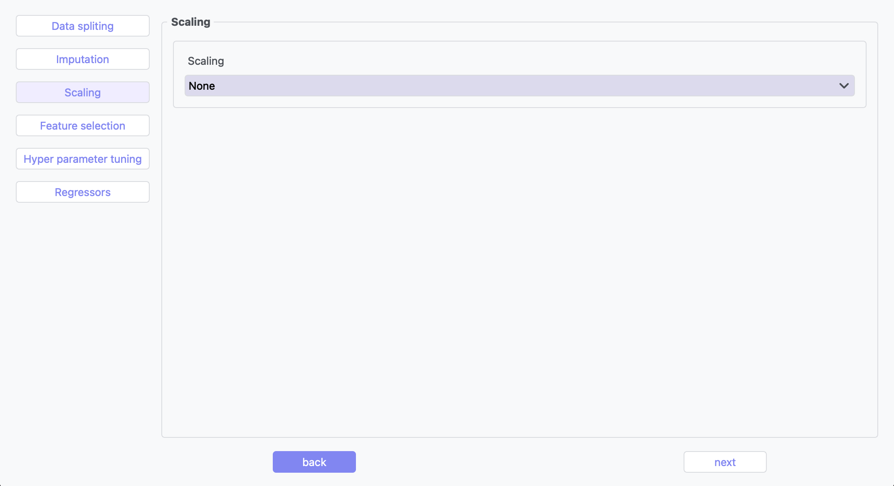
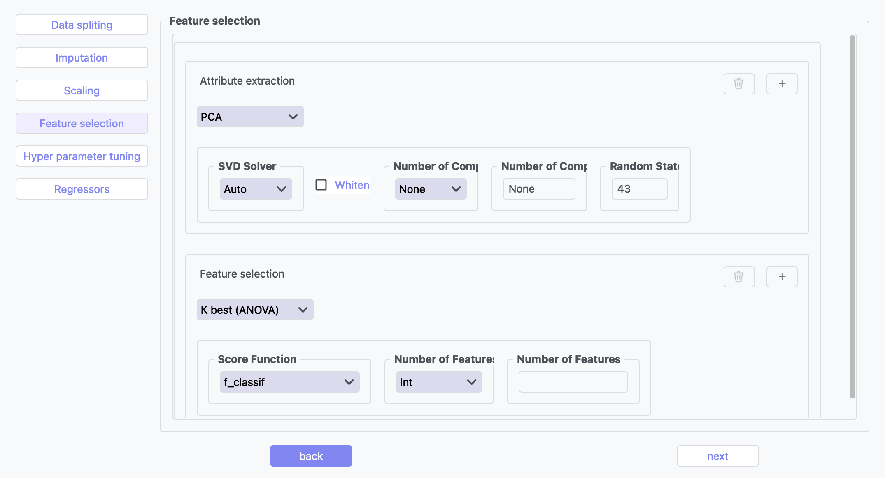

Regression
---------

Overview
^^^^^^^^

.. image:: images/15.regression.png
   :alt: Regression
   :width: 100%

The Regression tool provides multiple algorithms for predicting continuous target variables.

.. image:: images/15.regression_imputation.png
   :alt: Regression Imputation
   :width: 100%

The imputation step handles missing values in your dataset by replacing them with substituted values. Options include mean, median, or constant value imputation, ensuring your regression models can process complete datasets without gaps.

Feature scaling normalizes your data features to a similar range, improving model convergence and performance. Available methods include StandardScaler, MinMaxScaler, and RobustScaler, each optimized for different data distributions.

Feature selection identifies and retains the most relevant variables for your regression task. This reduces dimensionality, prevents overfitting, and improves model interpretability by eliminating redundant or irrelevant features.

.. image:: images/15.regression_hyperparameter_tuning.png
   :alt: Regression Hyperparameter Tuning
   :width: 100%

Hyperparameter tuning optimizes model parameters that cannot be learned from the data directly. Using techniques like grid search or random search, this process systematically identifies the best configuration for maximum predictive performance.

The algorithm selection interface allows you to choose and configure the appropriate regression model for your specific data characteristics and predictive goals.

Supported Algorithms
^^^^^^^^^^^^^^^^^^^^

**1. Linear Regression**

Standard approach estimating linear relationships between variables.

**Key Parameters:**

* **Fit Intercept**: Whether to calculate the intercept (default: True)
* **Positive**: Force coefficients to be positive (default: False)

**2. Ridge Regression**

Linear model with L2 regularization to reduce overfitting.

**Key Parameters:**

* **Alpha**: Regularization strength (default: 1.0)
* **Solver**: Method for computation (auto, svd, cholesky, lsqr, sparse_cg, etc.)
* **Fit Intercept**: Whether to calculate the intercept (default: True)
* **Max Iterations**: Maximum iterations for solver (default: 500)
* **Tolerance**: Precision of the solution (default: 0.0001)
* **Random State**: Seed for reproducibility (default: 43)

**3. Lasso Regression**

Linear model with L1 regularization promoting sparse coefficients.

**Key Parameters:**

* **Alpha**: Regularization strength (default: 1.0)
* **Fit Intercept**: Whether to calculate the intercept (default: True)
* **Max Iterations**: Maximum iterations for solver (default: 1000)
* **Tolerance**: Precision of the solution (default: 0.0001)
* **Selection**: Feature selection method (cyclic, random)
* **Random State**: Seed for reproducibility (default: 43)

**4. Logistic Regression for Regression**

Adapts logistic regression for regression tasks.

**Key Parameters:**

* **Penalty**: Regularization type (L1, L2, Elasticnet, None)
* **Regularization Strength (C)**: Inverse of regularization strength (default: 1.0)
* **Solver**: Algorithm for optimization (lbfgs, liblinear, newton-cg, sag, saga)
* **Max Iterations**: Maximum iterations for solver (default: 100)
* **L1 Ratio**: Mixing parameter for elasticnet penalty (default: 1.0)
* **Random State**: Seed for reproducibility (default: 43)

**5. AdaBoost Regression**

Ensemble method using weak regressors.

**Key Parameters:**

* **Base Estimator**: Type of weak regressor (DecisionTreeRegressor, etc.)
* **Number of Estimators**: Number of boosting stages (default: 50)
* **Learning Rate**: Weight applied to each regressor (default: 1.0)
* **Loss**: Loss function (linear, square, exponential)
* **Random State**: Seed for reproducibility (default: 43)

**6. Bagging Regression**

Ensemble method aggregating predictions from multiple models.

**Key Parameters:**

* **Base Estimator**: Base regressor type (DecisionTreeRegressor, SVR, etc.)
* **Number of Estimators**: Number of base estimators (default: 10)
* **Max Samples**: Samples per base estimator (default: 1.0)
* **Max Features**: Features per base estimator (default: 1.0)
* **Bootstrap**: Whether to sample with replacement (True/False)
* **Random State**: Seed for reproducibility (default: 43)

Evaluation Metrics
^^^^^^^^^^^^^^^^^^

* **Mean Absolute Error (MAE)**: Average of absolute differences between predictions and actual values
* **Root Mean Squared Error (RMSE)**: Square root of average squared differences
* **R-squared Score**: Proportion of variance explained by the model
* **Median Absolute Error**: Median of absolute differences between predictions and actual values

Regression Pipeline
^^^^^^^^^^^^^^^^^^^

The Regression tool guides you through a complete workflow:

** Data Requirement: The first column of both the input data and the target data must contain identical sample IDs

**1. Data Preprocessing**

* **Train/Test Split**: Divide data into training and testing sets
* **Feature Scaling**: Standardize or normalize feature ranges
* **Missing Value Handling**: Impute missing values with means, medians, or constants

**2. Model Selection**

* **Model Comparison**: Compare performance of different regression algorithms
* **Hyperparameter Tuning**: Find optimal parameter values
* **Cross-Validation**: Evaluate model performance on multiple data splits

**3. Model Evaluation**

* **Performance Metrics**: Calculate accuracy metrics on test data
* **Residual Analysis**: Analyze prediction errors and identify patterns
* **Feature Importance**: Evaluate contribution of each feature
