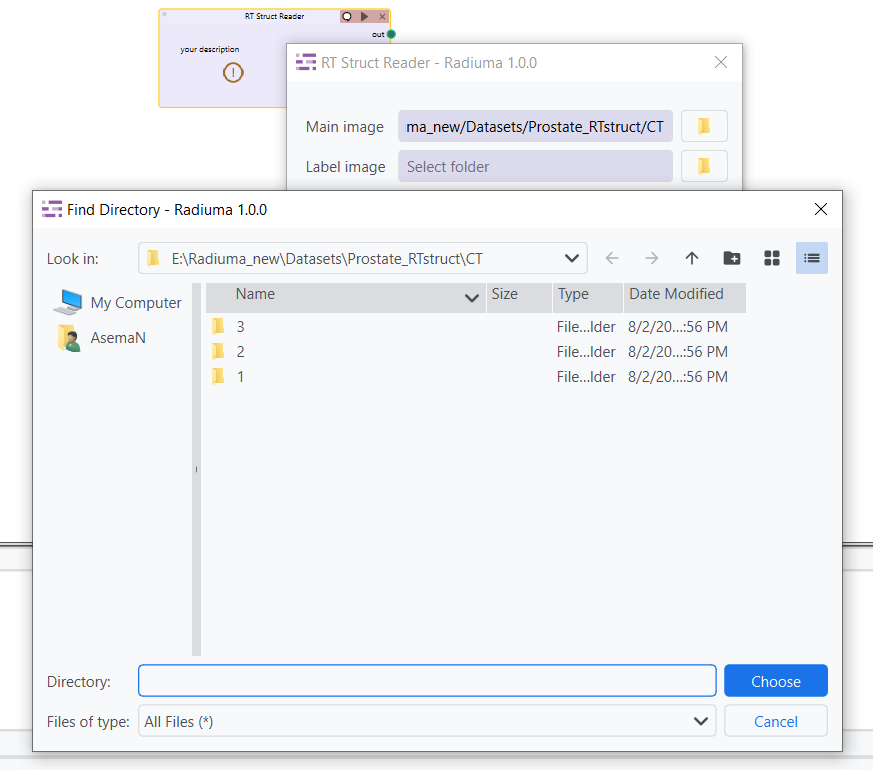
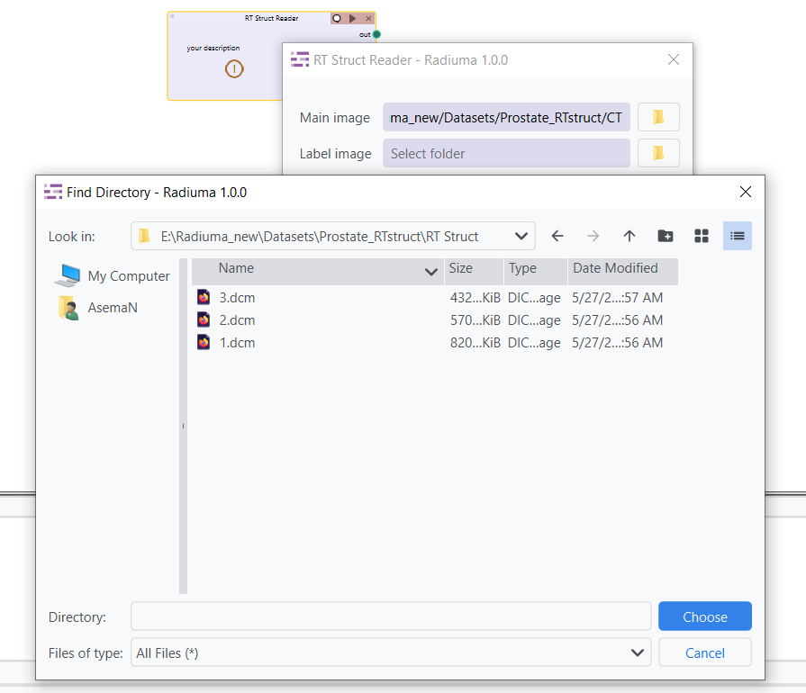
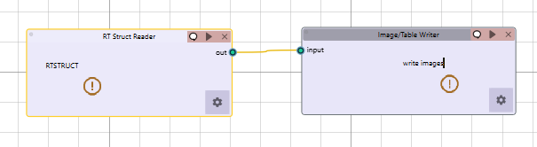

RT Struct Reader
----------------

.. image:: images/7.rt_struct_reader.png 
   :alt: RT Struct Reader
   :width: 100%

The RT Struct Reader module provides a specialized interface within Radiuma for importing and processing radiotherapy structure sets in the standardized DICOM-RT format, enabling seamless integration of radiation oncology contour data with corresponding medical images. This essential tool allows clinicians and researchers to import precise anatomical contours, tumor volumes, and organ-at-risk delineations from treatment planning systems, automatically pairing RTSTRUCT files with their corresponding image datasets through intelligent filename and directory matching. Through a structured import workflow with configurable directory parameters, users can efficiently load complex radiotherapy planning data, extract detailed contour information, and prepare labeled structures for downstream analysis in radiomics feature extraction, dose-volume analysis, and treatment response assessment—making it an indispensable component for radiation oncology research and clinical applicat

Important Notes
^^^^^^^^^^^^^^^^

To ensure proper pairing between RTSTRUCT and image data:

* If the RTSTRUCT is a **single DICOM file**, its **filename** must exactly match the **name of the corresponding image folder**.

   
The name of RTSTRUCT single dicom file  must exactly match the name of the corresponding image folder.

* Both RTSTRUCT and main image directories must follow a **single-level nested folder structure**, where each case is stored in its own folder or file (depending on the format).

Key Parameters
^^^^^^^^^^^^^^

* **RT Label Directory**: Path to the RT structure set file
* **RT Main Image Directory**: Path to the corresponding image data

Functionality
^^^^^^^^^^^^^

* Imports DICOM-RT structure sets along with their associated images
* Extracts contours and segmentation information
* Provides labeled structures for further analysis

Workflow Integration
^^^^^^^^^^^^^^^^^^^^

* Outputs to Radiomic Feature Generator
* Outputs to Image Writer
* Outputs to Image Viewer
