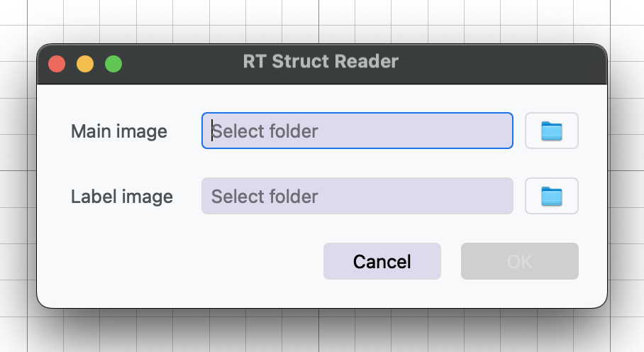

RT Struct Reader
----------------

Specialized tool for importing radiotherapy structure sets, supporting the standardized DICOM-RT format used in radiation oncology.

Key Parameters
^^^^^^^^^^^^^^

* **RT Label Directory**: Path to the RT structure set file
* **RT Main Image Directory**: Path to the corresponding image data

Important Notes
^^^^^^^^^^^^^^^^

To ensure proper pairing between RTSTRUCT and image data:

* If the RTSTRUCT is a **single DICOM file**, its **filename** must exactly match the **name of the corresponding image folder**.
* Both RTSTRUCT and main image directories must follow a **single-level nested folder structure**, where each case is stored in its own folder or file (depending on the format).

Functionality
^^^^^^^^^^^^^

* Imports DICOM-RT structure sets along with their associated images
* Extracts contours and segmentation information
* Provides labeled structures for further analysis

Workflow Integration
^^^^^^^^^^^^^^^^^^^^

* Outputs to Radiomic Feature Generator
* Outputs to Image Writer
* Outputs to Image Viewer
