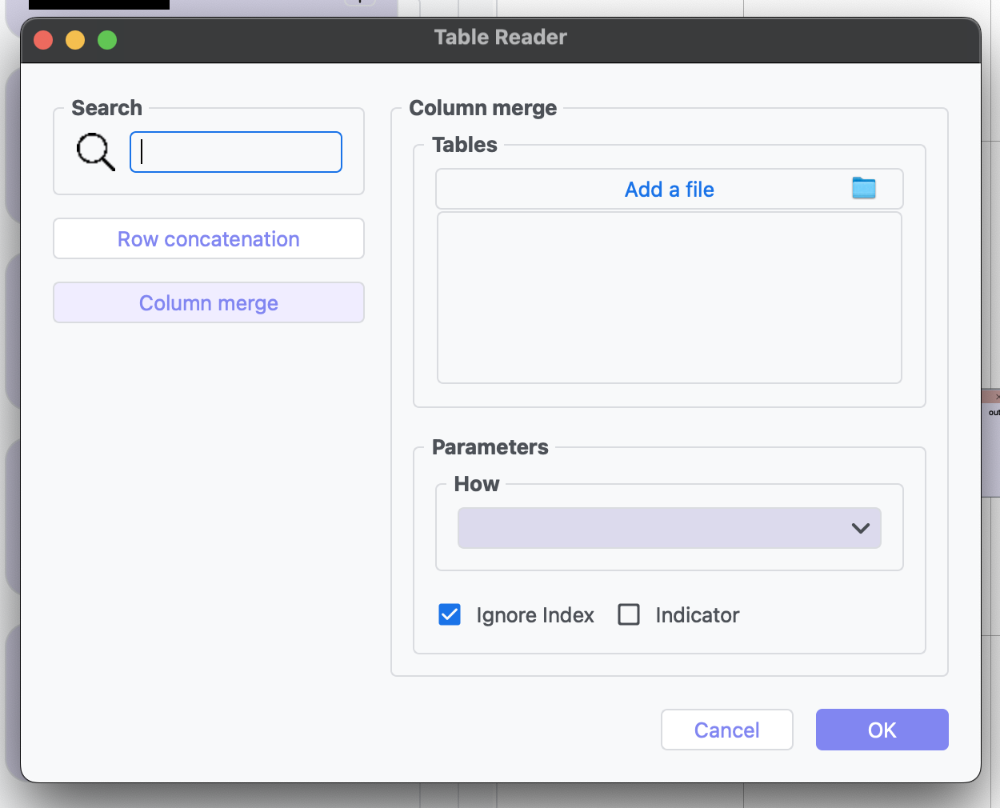

Table Reader
------------

.. image:: images/8.table_reader.png
   :alt: Table Reader
   :width: 100%

This tool is used for importing tabular data in various formats. The row concatenation feature allows users to combine multiple data tables vertically by appending rows from one table to another. This is particularly useful when merging data sets that share the same column structure.

The column merge capability enables combining tables horizontally by joining columns from different tables. This feature is essential when working with related data sets that need to be analyzed together, allowing users to create comprehensive views of their data.

Reader Parameters
^^^^^^^^^^^^^^^^^

* **File Path**: Location of the input data file
* **Format Detection**: Automatic detection of file format

Supported Formats
^^^^^^^^^^^^^^^^^

* CSV files
* Excel spreadsheets
* Structured data exports from analysis tools
