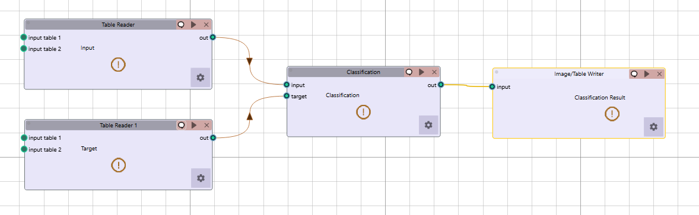
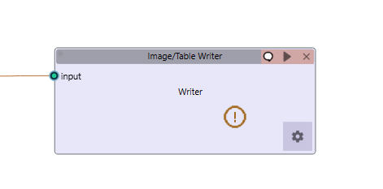

Visual Node-Based Workflow System
=================================

Radiuma uses a visual programming approach where tools are represented as nodes that can be connected to create complete data processing pipelines. This intuitive interface allows users with minimal programming experience to build sophisticated workflows.

Creating Workflows
------------------

1. **Adding Tools**: Double-click on a tool from the tool palette to add it to the workspace
2. **Configuring Tools**: Double-click on a tool node to open its configuration dialog
3. **Connecting Tools**: Click and drag from an output port to an input port to create connections
4. **Running Workflows**: Click the "Run" button on a node to execute it and all its prerequisite nodes
5. **Stopping Execution**: Click the "Stop" button on a running node or use the global "Stop Workflow" button in the log bar to halt execution

Multi-Tab Workflow Support
--------------------------

.. image:: images/4.tab.png
   :alt: Multi-Tab
   :width: 100%
   
Radiuma allows you to work with multiple workflows simultaneously through its tab-based interface:

1. **Creating New Tabs**: Click the "+" button on the tab bar or use the context menu to add a new workflow tab
2. **Renaming Tabs**: Right-click on a tab and select "Rename" to give your workflow a descriptive name
3. **Tab Management**: Each tab maintains its own independent workflow state and execution
4. **Importing Workflows**: When you import a saved workflow, it opens in a new tab automatically
5. **Drag and Drop**: You can drag .radioma files directly onto the application to open them in new tabs

Tool Compatibility
-------------------

Each tool explicitly defines which other tools can connect to its inputs and outputs, ensuring that only valid connections can be made:

* **Image Reader**: Outputs to Image Convertor, Filter, Fusion, and Registration tools
* **RT Struct Reader**: Outputs to Radiomic Feature Generator and Image Writer tools
* **Image Filter**: Takes image input, outputs to multiple imaging tools
* **Radiomic Feature Generator**: Takes image and mask inputs, outputs to data analysis tools
* **Preprocessing**: Takes feature data, connects to machine learning tools
* **Classification/Regression/Clustering**: Take preprocessed data as input, connect to visualization

Example Workflows
-----------------

**Basic Radiomics Analysis Pipeline:**

1. Image Reader → Load medical images
2. RT Struct Reader → Load region of interest segmentations
3. Radiomic Feature Generator → Extract quantitative features
4. Preprocessing → Prepare features for analysis
5. Classification → Analyze features for diagnostic/prognostic models

**Image Processing Pipeline:**

1. Image Reader → Load reference image
2. Image Reader → Load secondary image
3. Image Registration → Align images spatially
4. Image Fusion → Combine aligned images
5. Image Filter → Enhance features of interest
6. Image Writer → Save processed results

Workflow Controls
----------------- 

* **Layout Management**: Automatically arrange nodes with the "Align Tools" function
* **Tool Search**: Quickly find tools using the search function (Tab key)
* **Copy/Paste**: Duplicate node configurations to create similar processing steps
* **Save/Load**: Save entire workflows and reload them for future use
* **Workflow Stopping**: Two ways to stop a running workflow:
   * **Node-level Stop**: Click the stop button on an individual running node
   * **Global Stop**: Use the "Stop Workflow" button in the log bar to terminate all running tasks

System Resource Management
-------------------------

Radiuma provides notifications when system resources are limited:

* **Cache Warning** (When temporary storage is low):
   Temporary storage space (cache) is insufficient.
   Please choose a different location for storing temporary files,
   or split the data into smaller batches.

* **Memory Warning** (When system memory is low):
   Your system is low on memory.
   Try closing unused programs to help the application run smoothly.

These warnings appear as notifications in the status bar and log panel when detected

Keyboard Shortcuts
------------------

* **Tab**: Open tool search
* **Ctrl+C / Cmd+C**: Copy selected nodes
* **Ctrl+V / Cmd+V**: Paste nodes
* **Delete**: Remove selected nodes
* **D**: Lock/Unlock nodes 
