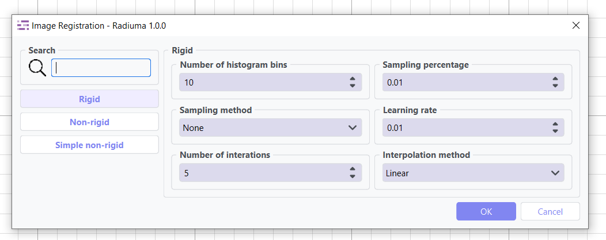

Workflow Modules
===============

Radiuma offers a comprehensive set of modular components that can be seamlessly connected to build end-to-end research workflows. These modules span the entire pipeline of advanced image processing and machine learning.

.. contents:: :local:

Image Viewer
------------

The Medical Image Viewer is a comprehensive module designed for advanced medical image visualization and analysis, providing tools for detailed examination, segmentation, and analysis of medical imaging data.

View Types
^^^^^^^^^^

* **Axial View**: Horizontal cross-sections (top-down view)
* **Sagittal View**: Vertical cross-sections from side to side
* **Coronal View**: Vertical cross-sections from front to back
* **3D View**: Complete three-dimensional rendering with:

  * Volume View: Full 3D visualization of image data
  * Mask View: Visualization of segmentation results

File Support
^^^^^^^^^^^^

* NIFTI Files: Support for Neuroimaging Informatics Technology Initiative format
* DICOM Files: Individual DICOM image support
* DICOM Directories: Support for complete DICOM studies/series
* Segmentation Files: Import/export of segmentation data

Toolbar Functions
^^^^^^^^^^^^^^^^^

**Image Navigation & Information**

* **Hand Tool**: Real-time coordinate display, intensity values, metadata access
* **Image List**: Layer navigation with options for information, removal, and colormap customization

**Image Manipulation Tools**

* **Segmentation**: Threshold-based and manual drawing tools
* **Crop Tool**: Define regions of interest
* **Ruler**: Precise distance measurements
* **Rotation**: Rotate images along any axis with animation capabilities
* **Contrast**: Window/level adjustment and brightness controls
* **Filter**: Apply threshold-based filters

**Visualization Controls**

* **Crosshairs**: Toggle visibility, synchronized across all views
* **Overlay**: Add image layers with transparency control
* **Screenshot**: Capture and save current view
* **Layout Control**: Reset to standard four-panel layout

Image Reader
------------

.. image:: images/6.image_reader.png
   :alt: Image Reader
   :width: 100%

A flexible module for importing various medical image formats into the Radiuma workflow.

Key Parameters
^^^^^^^^^^^^^^

* **Source Type**: Choose between folder or single file import
* **Path**: Location of the medical image file(s) to import

Supported Input Formats
^^^^^^^^^^^^^^^^^^^^^^^

* DICOM Files and Directories
* NIFTI Files (.nii, .nii.gz)
* Various other medical image formats

Workflow Integration
^^^^^^^^^^^^^^^^^^^^

* Outputs to Image Convertor
* Outputs to Image Filter
* Outputs to Image Fusion
* Outputs to Image Registration

RT Struct Reader
----------------

.. image:: images/7.rt_struct_reader.png
   :alt: RT Struct Reader
   :width: 100%

Specialized module for importing radiotherapy structure sets, supporting the standardized DICOM-RT format used in radiation oncology.

Key Parameters
^^^^^^^^^^^^^^

* **RT Label Directory**: Path to the RT structure set file
* **RT Main Image Directory**: Path to the corresponding image data

Functionality
^^^^^^^^^^^^^

* Imports DICOM-RT structure sets along with their associated images
* Extracts contours and segmentation information
* Provides labeled structures for further analysis

Workflow Integration
^^^^^^^^^^^^^^^^^^^^

* Outputs to Radiomic Feature Generator
* Outputs to Image Writer
* Outputs to Image Viewer

Table Reader
------------

.. image:: images/8.table_reader.png
   :alt: Table Reader
   :width: 100%

Modules for importing tabular data in various formats.

Reader Parameters
^^^^^^^^^^^^^^^^^

* **File Path**: Location of the input data file
* **Format Detection**: Automatic detection of file format

Supported Formats
^^^^^^^^^^^^^^^^^

* CSV files
* Excel spreadsheets
* Structured data exports from analysis modules

Image/Table Writer
------------------

.. image:: images/9.writer.png
   :alt: Writer
   :width: 100%

Modules for exporting tabular and image data in various formats.

Writer Parameters
^^^^^^^^^^^^^^^^^

* **File or Folder Path**: Location of the input data file or folder
* **Format**: Choice of output format (.xlsx, .csv, single/multiple .dcm, .nii.gz, .nrrd)

Writer Parameters
^^^^^^^^^^^^^^^^^

* **Path**: Destination for saving the output data
* **File Format**: Choice of output format (.xlsx, .csv, .dcm, .nii.gz, .nrrd)
* **Single/Multi File**: Option to save as single file or multiple files

Supported Formats
^^^^^^^^^^^^^^^^^

* CSV files
* Excel spreadsheets
* Structured data exports from analysis modules
* DICOM files
* NIFTI files
* NRRD files

Image Registration
------------------

Tools for spatial alignment of images from different modalities or time points.

Registration Types
^^^^^^^^^^^^^^^^^^

* **Rigid Registration**: Maintains shape and size, only allows rotation and translation
* **Non-Rigid Registration**: Allows local deformations for better alignment
* **Simple Non-Rigid**: Simplified version of non-rigid registration for faster processing

Key Parameters
^^^^^^^^^^^^^^

**Rigid Registration**

* **Number of Histogram Bins** (registration_Num_bin): Value for intensity histograms (default: 10)
* **Sampling Method** (registration_register_method): Method for sampling points during registration (None, Random, Regular)
* **Sampling Percentage** (registration_Sampling_percentage): Percentage of voxels to sample (default: 0.01)
* **Learning Rate** (registration_lRate): Step size for optimization (default: 0.01)
* **Number of Iterations** (registration_num_Iterations): Maximum iterations for optimization (default: 5)
* **Interpolation** (registration_interpolator): Method for interpolation (Linear, NearestNeighbor, BSpline, etc.)

**Non-Rigid Registration**

* **Number of Iterations** (num_iters): Iterations for deformable registration (default: 5)
* **Number of Resolutions** (num_reso): Multi-resolution levels for optimization (default: 1)
* **Final Grid Spacing** (fig_size): Density of deformation field (default: 1)
* **Transform Type** (transform_combo): Transform method (BSplineTransform is default)
* **Auto-Transform** (auto_transform): Automatic adjustment of transform parameters (True/False)
* **Auto-Scale** (auto_scale): Automatic scaling during registration (True/False)

**Simple Non-Rigid Registration**

* **Enable Simple Registration** (Simple_check): Toggle simplified non-rigid registration

Workflow Integration
^^^^^^^^^^^^^^^^^^^^

* Takes fixed and moving images as inputs
* Outputs transformed image aligned to reference

Image Filter
------------

.. image:: images/11.image_filter.png
   :alt: Image Filter
   :width: 100%

Comprehensive set of image filtering options for enhancing features, reducing noise, and preparing images for feature extraction.

Filter Types
^^^^^^^^^^^^

* **Mean Filter**: Smooths images by reducing noise while preserving edges
* **LoG (Laplacian of Gaussian) Filter**: Highlights edges and regions of rapid intensity change
* **Laws Filter**: Extracts texture features using small convolution kernels
* **Gabor Filter**: Texture and edge detection at various orientations and scales
* **Wavelet Filter**: Multi-scale analysis for feature extraction

Key Parameters
^^^^^^^^^^^^^^

**Common Parameters**
* **Filter Type** (TOOLTYPE): Selection of filter algorithm (Mean, LoG, Laws, Gabor, Wavelet)
* **Slice/Volume Processing** (mean_SliceOrVol, log_SliceOrVol, etc.): 2D or 3D filtering
* **Boundary Condition** (mean_BoundaryCondition, log_BoundaryCondition, etc.): Handling of image boundaries (Nearest, Zero, etc.)

**Mean Filter**
* **Filter Size** (mean_FilterSize): Size of the kernel for mean calculation (default: 1)

**LoG Filter**
* **Sigma** (log_Sigma): Scale parameter for Gaussian (default: 1)
* **Sigma Truncate** (log_SigmaTruncate): Truncation factor for Gaussian kernel (default: 1)
* **Calculate Average** (log_CalculateAverage): Whether to calculate average in filter (default: False)
* **Riesz Steered** (log_Riesz_Steered): Apply Riesz transform (default: False)
* **Riesz Parameters** (log_Riesz): Parameters for Riesz transform (default: "1,0,2")

**Laws Filter**
* **Kernel** (laws_Kernel): Specific Laws kernel to apply (default: "L5S5E5")
* **Calculate Energy** (laws_cal_energy): Calculate energy statistics (default: False)
* **Delta** (laws_delta): Step size parameter (default: 1)
* **Rotation Invariance** (laws_rotation_inver): Enable rotation invariance (default: False)
* **Pooling Method** (laws_pooling_method): Method for combining filter responses (default: "Max")

**Gabor Filter**
* **Gamma** (gabor_gamma): Controls filter shape (default: 1)
* **Lambda** (gabor_lambdaa): Wavelength of sinusoidal factor (default: 0.1)
* **Theta Initial** (gabor_theta_initial): Starting orientation of filter (default: 0.1)
* **Step** (gabor_step): Increment value for filter application (default: 0.001)
* **Response** (gabor_response): Type of filter response (default: "Abs")
* **Rotation Invariance** (gabor_rotation_inver): Enable rotation invariance (default: False)
* **Pooling Method** (gabor_pooling_method): Method for combining filter responses (default: "Max")
* **Sigma** (gabor_Sigma): Sigma value for Gabor kernel (default: 1)
* **Sigma Truncate** (gabor_SigmaTruncate): Truncation factor for Gaussian kernel (default: 1)

**Wavelet Filter**
* **Filter Configuration** (wavelet_filter_config): Specific wavelet decomposition level to use (default: "LL")
* **Filter Size** (wavelet_filterSize): Size of the filter kernel (default: 1)
* **Rotation Invariance** (wavelet_rotation_inver): Enable rotation invariance (default: False)
* **Pooling Method** (wavelet_pooling_method): Method for combining filter responses (default: "Max")
* **Decomposition Level** (wavelet_decomposition): Number of wavelet transform levels (default: 1)
* **Wavelet Family** (wavelet_wavelet_family): Type of wavelet (default: "Db")
* **Wavelet Type** (wavelet_wavelet_type): Specific wavelet implementation (default: "Db1")
* **Riesz Steered** (wavelet_Riesz_Steered): Apply Riesz transform (default: False)
* **Riesz Parameters** (wavelet_Riesz): Parameters for Riesz transform (default: "1,0,2")

Workflow Integration
^^^^^^^^^^^^^^^^^^^^

* Takes image input
* Applies selected filtering techniques
* Outputs filtered image for further processing

Image Fusion
------------

.. image:: images/12.image_fusion.png
   :alt: Image Fusion
   :width: 100%

Advanced capabilities for combining information from multiple imaging modalities.

Fusion Methods
^^^^^^^^^^^^^^

* **Weighted Fusion**: Linear combination of input images
* **Wavelet Fusion**: Multi-resolution decomposition and fusion
* **PCA Fusion**: Principal Component Analysis based fusion

Key Parameters
^^^^^^^^^^^^^^

**Weighted Fusion**

* **Weight 1**: Weight for first input image (0-1)
* **Weight 2**: Weight for second input image (0-1)
* **Interpolation**: Method for interpolating between images (Linear, Cubic, etc.)

**Wavelet Fusion**

* **Fusion Method**: Algorithm for combining wavelet coefficients (Max, Min, Mean)
* **Level**: Decomposition level for wavelet transform
* **Mode**: Signal extrapolation mode
* **Wavelet**: Wavelet family to use (Haar, etc.)

**PCA Fusion**

* **Number of Components**: Components to use in reconstruction
* **SVD Solver**: Algorithm for Singular Value Decomposition
* **Components**: Number of principal components

Workflow Integration
^^^^^^^^^^^^^^^^^^^^

* Takes two input images
* Combines information according to selected method
* Outputs a single fused image

Radiomic Feature Generator
------------------------

.. image:: images/13.radiomic.png
   :alt: Radiomic Feature Generator
   :width: 100%

Core module for extracting standardized quantitative features from medical images following IBSI guidelines.

Feature Types
^^^^^^^^^^^^^

* **First-order Statistics**: Intensity-based features
* **Shape-based Features**: Morphological characteristics
* **Texture Features**: Spatial patterns (GLCM, GLRLM, etc.)
* **Wavelet Features**: Multi-resolution analysis

Key Parameters
^^^^^^^^^^^^^^

* **Data Type** (radiomics_DataType): Modality type (MR, CT, PET, OTHER)
* **Discretization Type** (radiomics_DiscType): Method for binning intensity values (FBS, FBN)
* **Bin Size** (radiomics_BinSize): Size of intensity bins for feature calculation
* **Resampling Flag** (radiomics_isScale): Whether to perform scaling (0: disabled, 1: enabled)
* **Image Interpolation** (radiomics_VoxInterp): Method for resampling images (Nearest, Linear, Cubic)
* **ROI Interpolation** (radiomics_ROIInterp): Method for resampling masks (Nearest, Linear, Cubic)
* **3D Isotropic Voxel Size** (radiomics_isotVoxSize): Size for resampling to isotropic voxels
* **2D Isotropic Voxel Size** (radiomics_isotVoxSize2D): Size for 2D isotropic voxels
* **Isotropic 2D Voxels Flag** (radiomics_isIsot2D): Whether to resample to 2D isotropic voxels
* **Intensity Rounding** (radiomics_isGLround): Option to round intensity values (0: disabled, 1: enabled)
* **Segmentation Range** (radiomics_isReSegRng): Option to limit intensity range (0: disabled, 1: enabled)
* **Resegmentation Interval** (radiomics_ReSegIntrvl01, radiomics_ReSegIntrvl02): Min and max values for intensity range
* **Outlier Filtering** (radiomics_isOutliers): Methods for handling outliers (0: disabled, 1: enabled)
* **Quantization Method** (radiomics_qntz): Approach for discretizing intensities (Uniform, Lloyd)
* **Intensity Volume Histogram Type** (radiomics_IVH_Type): Setting for IVH unit type
* **IVH Discretization Type** (radiomics_IVH_DiscCont): Discrete or Continuous (1, 2, 3)
* **IVH Bin Size** (radiomics_IVH_binSize): Bin size for IVH discretization
* **Maximum ROIs** (radiomics_MaxROIsPerImg): Number of regions to analyze per image (Maximum or specific number)
* **ROIs per Image** (radiomics_ROIsPerImg): Number of ROIs to process when not set to Maximum
* **Combine ROIs** (radiomics_isROIsCombined): Whether to combine ROIs for analysis (0: disabled, 1: enabled)
* **Features to Output** (radiomics_Feats2out): Which feature set to calculate (options from 487 total features)

Workflow Integration
^^^^^^^^^^^^^^^^^^^^

* Takes both image and mask inputs
* Extracts features according to standardized definitions
* Outputs tabular data with all calculated features 
